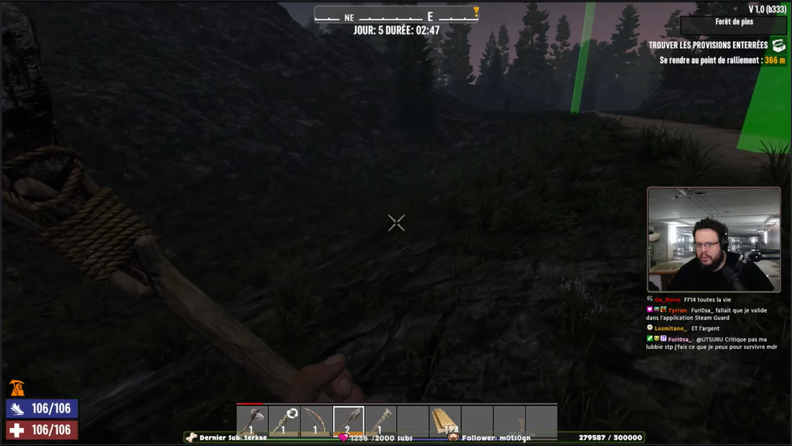
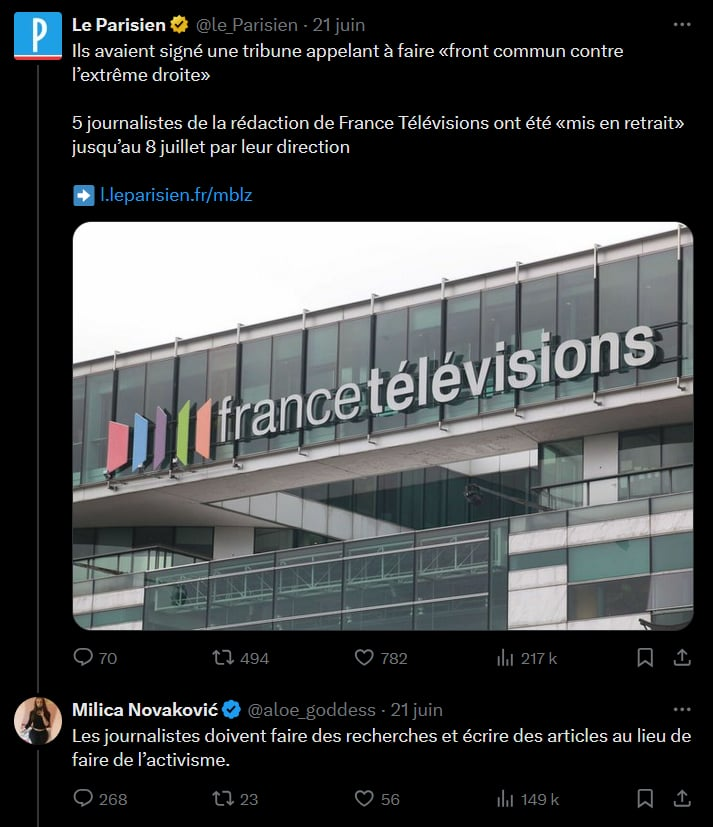

# Les codes formels de la voix internet {label=""}

La deuxième partie du texte de Gwendoline Soublin présente un évènement médiatique qui se déroule selon les estimations permises par le texte en 2056, trente ans après le suicide du personnage de la première partie. À mi-chemin entre une émission de télé-réalité et un *stream live* comme on peut en trouver sur les plateformes actuelles telles que Twitch ou Youtube, on y découvre le procès d'un porc nommé Pig Boy, qui est accusé d'avoir eu une relation sexuelle avec une femme humaine. On retrouve une référence claire aux procès d'animaux comme il s'en faisait à la période médiévale, pour les cochons notamment, lorsque ceux-ci étaient impliqués dans des morts accidentelles par exemple, ou lorsque l'animal avait servi à l\'accomplissement d'actes zoophiles. Dans le cas où ils étaient jugés coupables, ils étaient habillés puis exécutés, souvent pendus puis brûlés, comme c'est le cas dans la pièce. Le « procès » -- c'est aussi le titre de l'émission -- a lieu dans un tribunal ou un lieu similaire, comportant des membres de la cour, juge et avocate, et un auditoire. Il est également diffusé en direct à des millions de personnes (plus de deux milliards lors du verdict), en *translive *: ainsi les téléspectateurices et les *viewers*[^2-1] regardent le procès et peuvent même y participer dans un *chat* et avec des systèmes de vote, remplissant d'une certaine manière le rôle des jurés civil·es. L'émission est donc interactive, dans la mesure où ses consommateurices sont également producteurices d'une partie de son contenu. Dans la mise en page formelle, cette partie du texte se présente plus à la manière d'un calligramme ([@fig:fig-2-1]),[@apollinaireCalligrammes2013] utilisant l'espace de la page et les polices différentes pour suggérer les divers registres de paroles : titres, parties de prêts-à-diffuser, questions en live, parole des viewers ou des téléspectateurices, résultats et commentaires, publicité, musique...

{#fig:fig-2-1 width="17cm" height="9.555cm"}

En concentrant cette deuxième partie de mon mémoire sur la deuxième partie du texte de Pig Boy, j'aimerais relever les éléments du texte qui permettent de reconnaître la forme de l'émission dès la lecture, et préciser en quoi ces éléments sont plus caractéristiques des nouvelles plateformes de diffusion sur internet que de la télévision et la radio (parties [A](#interactivités-sources-multiples) et [D](#maîtriser-le-discours-donner-et-reprendre-la-parole)). J'énoncerai également des considérations sur les *topoi* récurrents d'Internet qui peuvent être trouvés dans les trois parties de la pièce (parties [B](#jouer-choisir) et [C](#topoi-de-la-solitude-et-de-la-mort)). Toutes mes remarques s'appuieront également sur une analyse des enjeux de pouvoir présents sur Internet et notamment dans les politiques de plateformes actuels qui informeront la dimension supposément dystopique de ce texte.

[^2-1]:
    J'utilise cet anglicisme pour faire la différence avec les téléspectateurices qui sont en présentiel avec le personnage de le·la présentateurice : sa traduction grossière serait visionneureuse ou voyeureuse.

## Interactivités, sources multiples

Qu'il s'agisse des résultats des pourcentages ou de la colonne « Vos commentaires », la deuxième partie du texte de Gwendoline Soublin est un texte à trous. Alors que l'histoire dont tu es le héros de la première partie ne semble pas pouvoir changer de voie, la deuxième partie implique les téléspectateurices et viewers de l'émission ainsi que les spectateurices de la pièce. Je définirai dans cette partie la notion d'interactivité, et sa filiation avec la communication internet.

### Un média interactif

On définit comme interactive une interface qui présente plusieurs natures de médias (son, vidéo, texte...) et qui réagit aux actions des utilisateurices. C'est le cas aujourd'hui d'à peu près n'importe quelle page internet. Menus déroulants, incrustations d'images animées, ou simplement hyperliens renvoyant à d'autres parties du site. Les forums de discussion, en plus d'être des supports interactifs, permettent non seulement d'interagir avec la machine mais aussi avec d'autres utilisateurices. Au contraire, la littérature n'est pas réputée pour être un média interactif, sauf peut-être aux quelques exceptions de la littérature hypertextuelle, des histoires dont le·la lecteurice est le héros ou de la poésie combinatoire de Raymond Quenaud[@raymondqueneauCentMilleMilliards1961]. Nous pourrions même dire qu'il s'agit plutôt des modalités de réception de l'œuvre que d'interaction, le matériau ne se modifiant pas à proprement parler mais étant seulement lu différemment. L'enjeu du *translive* de la deuxième partie est d'impliquer les *translivers* dans le déroulement du show, pour les amener à en consommer le contenu. Cependant, en laissant certaines parties du texte vides, Gwendoline Soublin laisse aussi la possibilité aux mises en scène de faire participer les spectateurices de la pièce, aux même titre que les autres *translivers*, faisant ainsi du public de la salle des voyeureuses ayant une existence narrative au sein de l'histoire.[@vegaTransmediaGrandeConvergence2012a] Notons qu'il ne s'agit pas d'une œuvre transmédia telle que la définit Henry Jenkins : bien qu'elle soit interactive , elle n'est pas immersive (la qualité d'un monde qu'on peut explorer de façon indépendante à l'histoire, comme dans les jeux vidéos) ni participative (les mondes qui sont construits en partie par les utilisateurices, par l'intermédiaire des *fan fictions* par exemple).[@noussommesiciNoShowShowmustgoonTout]

Cet enjeu est traité différemment selon les œuvres du corpus. La création radiophonique fait exister les *translivers* et les téléspectateurices comme deux entités différentes qui ont leurs présences sonores respectives dans la pièce mais se débarrasse complètement de l'aspect participatif du texte. En effet, sa mise en place nécessiterait une interface différente, par exemple une émission plateau en direct ou un site d'écoute à la demande qui pourrait prendre en charge l'influx des auditeurices. Telle quelle, la forme de la création radiophonique réalisée en amont et diffusée en amont ne permet pas l'interaction du public. Les mises en scène du Théâtres de l'Entre-Deux et du Bruit des Cloches prennent toutes les deux le parti de considérer le public de la salle et les téléspectateurices de la pièce comme une même entité. Les spectateurices sont donc complètement inclus·es, au même titre que les autres viewers dans le processus de vote de l'émission. Le vote s'effectue à main levée pour Théâtres de l'Entre-Deux et selon un système humoristique d'onomatopées pour le Bruit des Cloches (« Pour voter oui, répondez \*bruit de cochon\*, pour voter non, répondez \*deux bruits de cochon\*, pour voter ne se prononce pas, répondez \*trois bruits de cochon\* ») qui transforme la salle en porcherie l'espace de quelques secondes. Ces deux systèmes n'étant pas très précis, ils permettent d'annoncer les conclusions (qui sont, elles, écrites dans le texte) sans que celles-ci ne semblent trop hors de propos. Les pourcentages sont coupés dans les deux mises en scène, et Théâtres de l'Entre-Deux invente même « avec le vote des translivers » avant d'annoncer les résultats, ce qui ajoute une donnée inconnue aux spectateurices et permet de brouiller les éventuelles tendances qui serait identifiables dans la salle (une unanimité par exemple). Enfin, la mise en scène de Détour 21 supprime tout simplement la participation du public de la salle et la présence même de téléspectateurices dans la pièce : le translive n'est pensé qu'en distanciel, et les spectateurices sont des translivers. Dans la version présente, les pourcentages ne sont pas indiqués et la participation des translivers aux votes n'est même pas avérée, ce qui permet d'accentuer l'inéluctabilité de la sentence et le procédé de manipulation dans l'émission qui fait croire à une agentivité des viewers. Cependant, nous aimerions à terme mettre en place un système de vote réel, dans l'idée que l'incongruité des conclusions et la méfiance vis-à-vis des autres spectateurices se fera d'autant plus forte si les participant·es votent vraiment : le système totalitaire et biaisé dans lequel Détour 21 inscrit la deuxième partie n'en sera que plus tangible. La création radiophonique décide aussi de faire ressortir cet aspect en annonçant des pourcentages de plus en plus incohérents (lors du vote final : « oui 53 %, non 48,6 % , s'en remettent aux translivers 92 % »).

L'idée de réellement faire voter les spectateurices d'une pièce de théâtre a déjà été expérimentée auparavant. Par exemple, le spectacle *Le NoShow* créé en 2013[@noussommesiciNoShowShowmustgoonTout] proposait un vote réel par un système de numéro court sur lequel le public de la salle envoyait un SMS de choix, qui était ensuite utilisé dans la pièce. Cependant, ce système nécessite un support technique supplémentaire, qui n'est pas à la portée de toutes les compagnies, ni de tous les théâtres (il faut une infrastructure dans laquelle le réseau peut être maintenu). Dans *Pig Boy*, les SMS vont dans les deux sens, car certains sont aussi supposés être envoyés sur les téléphones des utilisateurices. Ce deuxième cas est plus problématique car il nécessite un accord préalable des spectateurices pour l'utilisation de leur numéro, et même une collecte, les théâtres n'ayant que rarement des listes de contact de leurs spectateurices qu'ils ont le droit d'utiliser. En effet, dans chacune des mises en scène, les SMS du texte sont soient dit par les voix de l'interface du translive, soit projetés sur l'écran dans le cas de Détour 21.

Les quatre instances du translive dans lesquelles l'espace des commentaires est ouvert s'organisent en trois colonnes dans le texte : la colonne de gauche, qui donne le discours dominant de la plateforme (Présidente Shanon, Maître Spare ou Katsue Matumato), la colonne du centre qui indique les commentaires des translivers, et qui sont toujours investis par les mises en scène et la mise en onde selon divers procédés (décrits dans l'annexe 1 : Répartition des voix), enfin la colonne de droite, intitulée « Vos commentaires » lors de sa première occurrence, et qui reste systématiquement vide. Cette section, qui rappelle les messages par défaut « Envoyez un message » ou « Commenter en tant que \[nom de l'utlilisateurice\] » dans les interfaces de *chat*,indique une participation potentielle du·de la lecteurice et par extension des spectateurices de la pièce. Cet élément n'a à ce jour été investi par aucune des mises en scène existantes, essentiellement pour des raisons techniques : difficulté de mise en place, de transportabilité selon les théâtres... Clara Ménard, metteuse en scène du collectif Détour 21, a proposé à son équipe de comédien·nes d'écrire eux·elles-mêmes des commentaires, mais ils n'ont finalement pas été gardés pour la version actuelle de la mise en scène. Il me semble cependant que cette colonne, aussi vide de texte soit elle, est en fait déterminante dans l'enjeu de l'interactivité et mérite qu'on lui accorde la plus grande attention. Elle nécessite effectivement une mise en réseau à un moment donné : cela peut-être une retransmission en direct du spectacle à un public à distance qui pourrait réagir (on pense au procédé de *\_jeanne\_dark\_* qui a ouvert la voix en 2020[@marionsiefert_jeanne_dark_2020]) ou bien un système de serveur local auquel les spectateurices pourraient se connecter. Ce deuxième cas, qui restreindrait la participation aux personnes présentes dans la salle, nécessiterait de repenser complètement le statut du public de la salle, pas tant pour sa participation active à la pièce, qui est souvent expérimentée au théâtre, mais pour sa participation virtuelle alors même qu'il se trouve dans la pièce avec les comédien·nes. En effet, le type de discours qui est permis par l'anonymat et la distance dans les commentaires n'est probablement pas celui que se permettraient des spectateurices ayant ne serait-ce qu'un contact visuel avec les personnages de la pièce. De la même manière, on pourrait imaginer une salle se transformant en assemblée, où le public pourrait énoncer à voix haute son avis, mais la probabilité que ce procédé prenne sans une médiation préliminaire importante est assez basse, à moins d'être avec des publics particuliers (on pense par exemple aux enfants[^2-8]).

En ce qui concerne les parties écrites qui émanent normalement des téléspectateurices, par exemple la vague de suicides qui est censée contaminer les viewers en distanciel et en présentiel, seule la mise en scène de Théâtres de l'Entre-Deux prend le parti de faire jouer cette partie au public. En effet, dans cette mise en scène, les deux accusateurices, les personnes qui se suicident et l'activiste anti-spéciste sont joué·es par des membres du public. Les complices viennent deux heures avant le début spectacle pour prendre connaissance de leur rôle auprès du metteur en scène Philippe Mangenot, puis se répartissent dans la salle avec le reste des spectateurices, ce qui donne une impression de spontanéité de leurs parties losqu'ils·elles prennent la parole. Le Bruit des Cloches, qui considère aussi le public comme les téléspectateurices, distribue toutes ces parties aux deux comédiennes. Les accusateurices sont des translivers à distance, qui sont donc dans le dispositif lumineux décrit en première partie et la vague de suicides est interprétée par les deux actrices qui se déplacent dans les allées entre les sièges du public pour figurer plusieurs personnages se suicidant. Le passage de l'activiste est complètement remanié : au moment du show de Youri, une des deux danseuses s'arrête, retire son masque et s'excuse auprès de ces collègues, disant ne plus pouvoir faire la comédie alors que Pig Boy est en danger (reprenant ainsi les mots de l'activiste). Cela interrompt la représentation de Youri, mais menace aussi la représentation de la pièce *Pig Boy* elle-même, le public de la salle ne sachant pas précisément ce qui est de l'ordre du jeu. Lors de la représentation à laquelle j'ai assisté, une femme au premier rang s'est levée, prête à venir en aide à l'actrice. Le passage des vigiles est aussi un moment qui tend à affirmer la fusion des téléspectateurices et des spectateurices de la pièce pour ces deux mises en scène (Détour 21 et la création radiophonique ont coupé ce passage). Le processeur du translive s'arrête momentanément, dans une tentative ultime d'arrêter le phénomène qui se propage grâce à l'interface, et pendant un temps le public se retrouvent face au *off*, le plateau du translive sans ses personnages et son spectacle. L'espace de *PROCÈS* se brise dans le texte, il est difficile de savoir si les répliques des vigiles sont adressées aux téléspectateurices ou au public, car la mise en forme est la même que dans l'émission, mais c'est aussi la mise en forme habituelle des textes de théâtre : on pourrait donc croire que l'émission coupée, les personnages reprennent leur audience par défaut, le public. Lors de l'appel des différentes personnes dans la salle, les deux mises en scène appellent à la fois des noms de personnages présents dans la pièce (Tao Wong, le colonel Vasseau) ce qui tend à garder la temporalité de la pièce, et les noms de leur équipe technique (les régisseureuses, les metteureuses en scène...) ce qui tendrait plutôt à briser l'illusion de la pièce et ancrer l'intervention des vigiles dans le réel. Ce double jeu permet de garder la frontière floue entre ce qui tient du spectacle et ce qui tient de la réalité, à l'échelle des spectateurices -- y a-t-il un problème de courant dans la salle ou est-ce écrit par Gwendoline Soublin ? -- et des téléspectateurices -- y a-t-il un problème de courant dans le translive ou l'intervention des vigiles fait-elle partie du show ?

Un dernier élément qui indique une participation des spectateurices organisée par le texte est la présence d'un triple scénario à la suite du vote final (p.51). Contrairement aux conclusions, ce dernier choix dépend du résultat du vote, même si l'issue des trois scénarios est en fait la même : Pig Boy est mis à mort. Aucune des œuvres du corpus ne faisant réellement voter le public avec un système qui permettrait d'établir un résultat précis, chacune décide à l'avance du choix qu'elle fera. La création radiophonique et la mise en scène de Théâtres de l'Entre-Deux décident toutes les deux de couper les scénarios, passant du résultat -- « coupable ! » -- à l'annonce de la sentence par la Présidente Shanon. La mise en scène du Bruit des Cloches choisit le premier scénario, dans lequel le résultat penche pour OUI (88%), et les comédiennes disent le texte rythmiquement, à la manière d'un rap. Cette diction accentue l'aspect de divertissement que prend cette mise à mort, et que nous étudierons plus précisément en fin de partie. Enfin, la mise en scène de Détour 21 choisit le deuxième scénario, celui dans lequel les votant·es décident de sauver Pig Boy et de le considérer innocent. Ce scénario est le plus invraisemblable, il raconte comment le porc se met enfin à parler, pour avouer sa culpabilité et demander sa propre mise à mort. Il correspond cependant parfaitement à l'intention dramaturgique de la metteuse en scène, qui veut souligner que l'émission est truquée et scénarisée du début à la fin, et que la sentence capitale est prévu à l'avance. Par ailleurs, puisque c'est la seule version où la parole n'est jamais laissée au porc, les spectateurices n'ont pas la preuve qu'il ne parle pas. Raconter sa logorrhée fantastique au discours indirect continue de tracer la ligne dramaturgique d'une parole maîtrisée et « médiatisée », dans le sens où elle n'est plus portée par le personnage concerné mais par l'infrastructure qui l'entoure et l'empêche.

La dimension d'interaction avec le public rappelle les émissions concours de télévision, comme *The Voice*, où le vote du public est demandé et modifie l'issue de l'émission, son·sa gagnant·e. Il est important de rappeler que ce procédé, plus qu'une intention démocratique de libre participation, sert surtout à générer un profit considérable pour les chaînes de télévision, l'envoi du message de vote étant payant. On peut également faire le parallèle entre ce procédé et je jeu dont tu es le héros de la première partie : ici, il s'agit d'un jeu à plus grande échelle, où l'agentivité présente n'est pas celle du personnages concerné. Tous·tes les participant·es s'expriment en lieu et place de Pig Boy pour décider de son sort.

[^2-3]:
    raymondqueneauCentMilleMilliards1961

[^2-4]:
    Très récemment, on peut penser à l'exemple du spectacle *Daddy* de Marion Siéfert qui implique le public en tant que *fanbase* du jeu qu'elle met en scène. Voir @marionsiefertDaddy2023.

[^2-5]:
    vegaTransmediaGrandeConvergence2012a

[^2-6]:
    noussommesiciNoShowShowmustgoonTout

[^2-7]:
    marionsiefert_jeanne_dark_2020

[^2-8]:
    Un exemple récent au Théâtre Nicole Loraux de l'ENS : *Et maintenant nous allons faire une fête épouvantable*, spectacle jeune public qui proposait aux spectateurices de commenter les passages des comédien·nes en direct, ce que les enfants ont fait avec joie, alors que les adultes s'y risquaient beaucoup moins.

### Codes formels : multiplicité des sources et discours types

Une autre particularité des flux internet est son essence multimédia. La plupart des pages web sont interactives, comme expliqué dans le début de cette partie, et rassemblent des contenus et des sources différentes comme du texte, des images, de la vidéo... Dans la deuxième partie de Pig Boy, les différences de police permettent très vite au·à la lecteurice d'identifier des sources différentes, alors même que tout est techniquement textuel. Les didascalies indiquent parfois un média particulier, par exemple la musique d'*Il était une fois dans l'Ouest* ou encore les SMS, qu'on imagine être envoyés directement aux translivers avec une notification personnelle. Le texte de la plateforme comme les jingles, indiqué en petites capitales, est aussi différencié des paroles des personnages : on peut ainsi les imaginer sur deux médiums différents. Le texte de Gwendoline Soublin ressemble indéniablement, dans sa mise en forme, aux modes de communication issus du réseau internet, et plus spécifiquement des plateformes de *stream* vidéo sur certains aspects. Je prends la plateforme *Twitch *pour exemple, de manière à pouvoir tirer des parallèles avec la présentation formelle du texte.

La plateforme Twitch, lancée en 2011 et rachetée par Amazon en 2014, est à l'origine un service de *streaming* dédié aux jeux vidéos. En effet, elle est en fait le résultat de la scission de la catégorie *gaming* de Justin.tv, qui fonctionnait plus que les autres catégories. Elle propose à la fois du streaming en direct et des vidéos à la demande. La majorité du contenu repose donc sur le modèle du *stream *personnel, où un joueur se montre en train de jouer, permettant ainsi la discussion, l'apprentissage du jeu par d'autres ou encore les tournois d'*e-sport*. On peut décrire une fenêtre de stream type de la manière suivante :

-   En grand se trouve l'écran du joueur, sur lequel on peut voir le jeu auquel il est en train de jouer. Du jeu dépendent la plupart des paramètres que l'on voit, les points de vie, la temporalité du jeu, la boîte à outils, etc.
-   Très souvent, une petite fenêtre montre le *streamer* lui-même, qui réagit à sa propre partie et au commentaires des viewers. Cette fenêtre est le plus souvent en bas, à droite ou à gauche, et peut être une image du streamer dans l'endroit où il se trouve (à la manière d'un *videocall*) ou une découpe sur fond vert qui est incrustée directement dans l'écran de jeu.
-   Le *chat* peut lui-même apparaître sur l'écran, selon l'envie du streamer, et certains messages peuvent être lus par une voix synthétique. La fenêtre est aussi disponible aux viewers dans l'interface de Twitch sur la droite, elle est peut être visible ou non.
-   Les conditions d'accès au *chat* peuvent varier, allant de n'importe quelle personne avec un compte Twitch à l'exclusivité pour les followers, mais de manière générale ils sont ouverts aux comptes dits « vérifiés », c'est à dire dont la validité a été confirmée par un numéro de téléphone attribué. La plupart du temps, un message de bienvenue stipule les règles du *chat* avant que l'on puisse y participer, des prescriptions de bienséance essentiellement (ce qui fait penser au SMS d'introduction du translive dans la pièce).
-   La plupart des messages concernent le stream en cours : réactions, aide au joueur... Les utilisateurices ont également tendance à se répondre les uns les autres quand des questions sont posées ou simplement pour réagir ensemble. Un système de *tag* permet d'identifier le message précédent auquel un message envoyé répond.
-   On trouve aussi régulièrement un bandeau, en haut ou en bas, qui indique le plus souvent le pseudo de la dernière personne ayant souscrit à la chaîne (abonnement payant) et la dernière personne l'ayant suivie.
-   Les sons présents sont ceux du jeu, la voix du streamer et parfois la voix synthétique des commentaires, et certains sons liés à l'activité des viewers, comme le signal d'un renouvellement d'abonnement (qui est souvent caractérisé par un bruit d'argent cliquant ou de machine de banque)

{#fig:fig-2-2 width="17cm" height="9.59cm"}

{#fig:fig-2-3 width="17cm" height="9.608cm"}

Néanmoins, les créateurices de Twitch ont aussi progressivement proposé d'autres contenus, comme des discussions, d'abord liées aux jeux vidéos, puis d'autres contenus créatifs (rassemblés sous l'étiquette *creative* par Twitch) et enfin des contenus divers (catégorie *IRL*) et notamment journalistiques, comme des lectures de textes scientifiques ou des matinales d'information. Cette dernière catégorie est investie majoritairement par des streamers situés à gauche de l'échiquier politique[@LecturesFeministesStream], qui vulgarisent les écrits théoriques et commentent l'actualité. J'aimerais prendre le cas de la chaîne d'Ostpolitik, qui propose des revues de presse, et dont le contenu journalistique peut donc s'apparenter aux médias d'information plus traditionnels comme les journaux télévisés. J'ai basé mon analyse sur un stream du 26 juillet 2024 ayant lieu de 12h à 14h. En plus des caractéristiques communes avec les streams de gaming, voici les éléments saillants que j'ai pu relever dans ses streams et qui trouvent écho dans le texte de Gwendoline Soublin.

-   Le *chat* contient des formules idiomatiques de salutations en début et en fin de stream : pour Ostpolitik, on retrouve par exemple divers variations de « bonjour la gauche », ou des formules plus générale comme « salut à tous » qu'on peut apparenter aux « Hey ! Salut salut. » de début de translive.

-   Pendant la durée du stream, le *chat* comprend essentiellement des réactions à l'actualité et aux propos du streamer (comme « la honte » ou « GG » -- *good game* à la base, qui marque plus généralement l'acquiescement ou « bravo »), des blagues et des questions (dans ce cas-ci, pertinentes, mais qui peuvent devenir hors sujet lors de streams plus gros, ou la modération est plus fastidieuse et procède donc par priorité). Dans cet exemple qui se situe pendant les jeux olympiques 2024, on trouve également des opinions qui ont attrait à des faits plus généraux, par exemple « BOYCOTT JO », qui peuvent faire penser aux slogans de certains translivers comme « FREE PIG BOY ».

-   L'utilisation des sondages est assez répandue, et l'avis de l'ensemble des viewers peut être demandé simplement, notamment quand des réponses commencent à s'esquisser dans le *chat*, de manière à établir des pourcentages.

-   La présence de jingles (composés par le·a streamer ou non) ainsi que d'éléments audiovisuels référencés (textes ou images accompagné·es de sons) ponctuant le déroulement du stream ou les actions des viewers est aussi très courante, ce que le stream a en commun avec les émissions des médias télévisuels et radiophoniques. Il y a également dans ce stream spécifique un bandeau déroulant qui indique le programme de la matinale, comme sur certaines chaînes télévisuelles, d'information en continu notamment. Ces deux éléments ajoutent à la multiplicité des sources présentes, et se retrouvent dans le texte de *Pig Boy 1986-2358* par les différents encarts qui ponctuent la continuité du procès.

On peut aussi noter quelques dissemblances avec le translive du texte :

-   Même si il y a une certaine autonomie de la discussion dans le *chat*, le streamer le lit et réagit aux blagues, précise certaines choses, alors que les commentaires du translive sont complètement indépendants des prises de parole des acteurices du procès dans *Pig Boy 1986-2358*.
-   Le·a modérateurice n'est pas un algorithme mais une personne habituée au streamer et à ses limites. Elle se trouve directement dans le *chat *avec les autres utilisateurices mais peut décider de supprimer des commentaires par exemple. Le·a streamer lui·elle-même modère aussi parfois, et il·elle peut utiliser des *bots*[^2-10] pour l'aider, mais il y a toujours une réflexion humaine derrière. Parfois Twitch régule aussi les flux, avec par exemple des fonctions de ralentissement comme le « mode lent » qui limite la fréquence des commentaires des viewers (un message toutes les 3 secondes, un message toutes les 30 secondes...).

Les plateformes de streaming sont un médium qui est associé à un public jeune dans l'imaginaire commun, même si une partie importante des créateurices de contenu se situe plutôt dans la trentaine. Les communautés internet marquant également un certain désintérêt pour les contenus politiques, elles ont été un public cible à la fois pour les hommes et femmes politiques, ainsi que pour d'autres groupes idéologiques non représentés dans le débat public, qui se sont appliqués à proposer du contenu politique sous d'autres formes, et notamment par les opinions des inflenceureuses. On pense par exemple au stream *#SansFiltre* qu'a proposé Gabriel Attal, alors porte-parole du gouvernement, lors de la pandémie du COVID-19. L'idée principale de cette stratégie et de remplacer l'espace du meeting politique par une situation plus informelle (par des éléments comme la conversation libre et le tutoiement), et de faire passer des messages politiques de manière indirecte. Ce qui rend cette situation si différente d'un plateau télé ou d'une conférence de presse, ce n'est pas tant le caractère informel de la situation que son absence de journalistes, qui sont normalement les médiateurices qui font le lien entre la production de contenu informatif ou politique et nous. L'information, sans médiateurices et sans spécialistes, devient alors un terrain d'opinions. Cette guerre des opinions est très présente dans la deuxième partie de *Pig Boy 1986-2358*, où le procès se déroule sans médiateurices et sans que l'auditoire ne soit présenté dans ses réactions comme un public averti qui sait comment se déroule un procès et peut s'y repérer sans médiation. L'espace du direct, bien qu'il soit composé de paroles médiatisées technologiquement, engage une « démédiatisation » de la parole, c'est-à-dire que les intermédiaires disparaissent.[@douyereYoutubeEspaceExpression2019]

Nous avons vu plus haut que certains streams Twitch avaient des points communs avec les flux télévisuels comme les jingles qui ponctuent le déroulement de l'émission ou encore des aspects formels comme les bandeaux déroulants qui ajoutent une strate d'information décorrélée de ce qui est discuté par les journalistes. Le média Blast va même jusqu'à demander si ces streams, « c'est pas toujours de la télévision »: il y a un plateau, des gens qui parlent de sujets d'actualité, des animateurices, des chroniqueurices, des invité·es. On peut trouver des streams appelés *reacts*, où les streamers regardent des documents télévisuels et les commentent. De même sur des réseaux sociaux comme X (ex-Twitter) ou Facebook, les publications reprennent essentiellement des extraits d'émissions télévisées. On remarque également une certaine perméabilité de la télévision et des plateformes de streaming, avec par exemple l'arrivée du streamer Hugo Décrypte sur la chaîne de télévision publique France 2 ou encore le présentateur Samuel Étienne qui est désormais streamer également.[@blastlesouffledelinfoTELEVISIONQUANDBOURDIEU2024, 3:22] Cependant, deux traits essentiels opposent la télévision (et la radio avec elle) aux logiques des plateformes. Tout d'abord, les chaînes de télévision et de radio continuent de tenir une ligne éditoriale et de produire leurs émissions, là où la charge de production et de rentabilité incombe aux seul·es créateurices sur les plateformes de streaming. D'autre part, les flux télévisuels et radiophoniques descendent a priori uniquement de manière verticale, des chaînes vers les téléspectateurices/auditeurices, tandis que les plateformes organisent des flux à double sens, où le contenu arrive aux viewers et où les données de ces derniers remontent à la plateforme. Les consommateurices du contenu s'en font donc aussi les producteurices.[@dujarierTravailConsommateur2014, pp.5-18]

La dystopie du translive que nous présente Gwendoline Soublin dans *Pig Boy 1986-2358* emprunte à chacun des deux médias. Le programme *PROCÈS* semble être diffusé par une chaîne, *Nation News*, qui se présente comme un « flux continu », et « auquel \[les viewers prennent\] part » (p.21), et la présence du *chat *et des informations en direct sur le nombre de participant·es tend à caractériser le direct qui provient des plateformes. Cependant le titre de la chaîne, la présence d'une multitude d'invité·es, la place dans le texte d'une voix de présentateurice qui s'adresse aux viewers, tous ces éléments renvoient plutôt à l'imaginaire de la télévision. On imagine donc une sorte de chaîne en continu, diffusée depuis une plateforme de streaming et par internet, qui aurait assimilé les codes de la télévision. Un monde, probablement, dans lequel la télévision ne serait plus un médium à part entière mais confondu dans les flux internet. Ce parallèle rappelle d'ailleurs les origines de la télévision : la technologie vidéo n'était d'abord que du direct, il était impossible d'inscrire le signal vidéo sur un support. Les écrans de télévision étaient filmés avec une caméra argentique pour avoir des enregistrements de ce qui était diffusé en direct. L'histoire de la télévision est très liée à la technologie vidéo, qui est aussi celle utilisée dans les flux internet, et donc à la notion de direct. Le texte de Gwendoline Soublin s'amuse encore une fois à fonder son ambiance dystopique sur des similitudes entre passé proche et futur proche.

Dans les mises en scène de Théâtres de l'Entre-Deux et du Bruit des Cloches, les metteureuses en scène ont décidé de représenter le translive de la deuxième partie sans recourir à l'audiovisuel. Dans les deux cas, les commentaires sont dits par les comédien·nes. Pour rappel de la première partie de ce mémoire sur le traitement des voix, Théâtres de l'Entre-Deux propose un dispositif avec une pancarte qui indique le pseudo du personnage et une déformation en direct de la voix. Le Bruit des Cloches utilise quant à lui la voix modifiée du musicien en direct pour annoncer les pseudos et deux sons courts qui encadrent la prise de parole de la comédienne qui fait les commentaires. La création radiophonique fait bien évidemment aussi dire les commentaires par des voix, assez réalistes, qui existent dans un espace différent de la prise de parole des acteurices du procès par le fond sonore qui les accompagnent. Ce sont comme des échantillons de vie, et on apprend beaucoup de la situation du viewer par l'environnement sonore qui apparaît lors de sa prise de parole. Seul le collectif Détour 21 propose de montrer le *chat *par le médium duquel il est issu, en projetant le texte des commentaires sur un écran sur le côté de l'espace de jeu des comédien·nes, celleux-ci ne prenant en charge que les acteurices du procès et les épisodes pré-enregistrés. La prise de parole des personnages qui sont soumis au flux de commentaires retrouve donc l'intelligibilité des paroles de streamers, qui ne sont pas interrompues par le *chat*. Lorsque le *chat* lui-même est ponctué par des messages de l'hébergeur ou des virus, ceux-ci sont diffusés sur le grand écran de fond de scène. Les SMS sont affichés sur l'écran par l'intermédiaire d'un bandeau déroulant, ce qui rappelle les bandeaux que j'ai relevés sur Twitch ou les chaînes d'information en continu : l'écran est lui-même une interface contenant de multiples sources.

[^2-9]:
    LecturesFeministesStream

[^2-10]:
    Petits algorithmes simples qu'il est nécessaire de programmer soi-même.

[^2-11]:
    douyereYoutubeEspaceExpression2019

[^2-12]:
    blastlesouffledelinfoTELEVISIONQUANDBOURDIEU2024 , 3:22

[^2-13]:
    dujarierTravailConsommateur2014 , pp.5-18

## Jouer, choisir

Seule la deuxième partie de *Pig Boy 1986-2358* implique matériellement les spectateurices et téléspectateurices, cependant les notions de jeu et de choix traversent la pièce dans son intégralité. Elles se manifestent sous différentes formes, et j'essaierai de dresser une liste exhaustive des occurrences dans cette partie.

### Jeux

Dans la première partie, plusieurs jeux s'entrelacent à plusieurs échelles. Tout d'abord, le procédé formel dans l'écriture des choix fait penser aux livres dont tu es le héros, un genre plutôt présent dans la littérature jeunesse. L'idée est qu'après une portion de l'histoire, le·la lecteurice puisse faire un choix parmi deux propositions, et que ce choix l'amène à un autre endroit du livre : ainsi, le déroulé du récit dépend des choix qui sont faits par le·la lecteurice, même si toutes les parties sont écrites à l'avance. Dans *Pig Boy 1986-2358* chaque paragraphe de narration, écrit à la deuxième personne du singulier, est suivi par un dilemme entre deux choix écrits en capitales, et ce jusqu'à la fin de l'histoire. On peut noter une occurrence d'un choix à trois entrées, une occurrence d'un choix unique et une occurrence d'un choix à sept entrées, toutes identiques. Il s'agit des trois derniers choix du texte, qui n'interrompent donc pas le procédé formel mais le dépassent en fin de partie. Bien que ces choix prennent la même forme que dans un livre dont tu es le héros, ici il n'y a aucune agentivité du·de la lecteurice (et donc des spectateurices) puisque le récit avance de façon linéaire dans tous les cas. Le sens du texte tend à impliquer que le personnage principal n'a pas non plus d'agentivité, nous verrons plus loin en quoi ce procédé soulève l'inéluctabilité de son destin. À partir du choix « 1 - VOUS REMERCIEZ LE COCHON POUR SA VIE 2 - VOUS RÉFLÉCHISSEZ AU PROGRAMME TÉLÉ DU SOIR » (p.11), le corps du texte n'indique plus quel choix est fait par le personnage, ce qui renforce son manque d'agentivité, et inscrit le procédé formel dans une dynamique poétique répétitive plutôt que dans une nécessité de sens.

Dans la mise en scène de Théâtres de l'Entre-Deux, chaque choix annoncé est ponctué par des « yes » de satisfaction ou des « iiich » de défaite, comme si quelque chose de très important se jouait, ou qu'il s'agissait d'un match serré entre deux camps (peut-être les deux camps qu'illustrent la création radiophonique avec ses deux voix). C'est un jeu, mais un jeu qui est pris très au sérieux, qui tient à cœur les comédien·nes et qui, en début de partie du moins, peut vraiment tourner d'une manière ou d'une autre. Rien n'est encore écrit. Ce jeu est cependant comme regardé depuis l'extérieur : le personnage principal est passif et ne fait pas de commentaires sur ce qu'il lui arrive. Dans la mise en scène du Bruit des Cloches, le jeu des comédiennes ne fait pas vraiment ressortir la dimension ludique de l'histoire dont tu es le héros : par leur ton, on comprend dès le commencement qu'il n'y aura pas de choix possible.

Le jeu télévisé Miss France prend aussi une part importance dans le texte de la première partie : c'est la seule émission que la famille Bouquet s'autorise à regarder, et le choix final entre les deux miss régionales ponctue régulièrement les choix du texte, illustrant les années qui passent puisque ce jeu est un programme annuel. L'émission est aussi un indicateur de classe sociale dans l'imaginaire commun, et place la famille du personnage dans un certain cadre, notamment en ce qui concerne les masculinités et les féminités canoniques de leur milieu. Le choix à trois entrées, page 18, renvoie également à un jeu télévisé, *Qui veut gagner des millions *: « 1 - VOUS DEMANDEZ LE VOTE DU PUBLIC 2 - VOUS PRENEZ LE 50/50 3 - VOUS APPELEZ UN AMI ». Ce choix, qui renvoie à une échappatoire lorsqu'on est bloqué dans ce jeu, pose ici paradoxalement l'impossibilité du personnage d'échapper aux huissiers, et donc à son destin, et introduit la scène du suicide final (p.19). Enfin dans la deuxième partie de *Pig Boy 1986-2358*, l'émission *PROCÈS*, que j'ai étudié sous l'angle de l'interactivité dans la partie précédente, correspond également aux codes formels du jeu télévisé.

### Paradoxe du choix

Tous ces jeux demandent à un moment de leur déroulé le choix des participant·es. Hors dans la pièce, et notamment dans la première partie, le paradoxe de tous ces choix énoncés face à l'absence de choix pour le personnage est frappant. Théodore Bouquet, petit éleveur de porcs breton qui reprend une exploitation endettée en 2014, n'a pas le choix. Bien que la pièce soit fictive, le récit du personnage principal s'inspire très précisément de notre réalité.

En 2014, cela fait plusieurs années que le coût de production des porcs augmente (notamment le coût de leur alimentation), et donc que le prix du porc, déterminé à l'échelle nationale par le Marché du Porc Breton, augmente aussi. Les grands industriels achètent la viande de porc moins chère à d'autres pays européens, ce qui provoque une crise de l'offre : trop de porcs sont produits, et ne sont pas vendus, ou à perte. Les prix n'augmentent pas pour les consommateurices en fin de chaîne (les acheteureuses en supermarché), c'est donc un gain sur la productivité qui doit venir des exploitant·es pour « redresser la barre » (expression utilisée par le personnage de la première partie page 17). Les grandes exploitations ne réduisent pas le coût de production, contrairement à ce que l'on pourrait croire, les marges sont en fait prises sur les cotisations sociales (la protection sociale des salarié·es) et sur une « simplification administrative » (des mesures de relâchement des contrôles sanitaires et de relèvement des seuils maximum de porcs qui permettent les exploitations géantes). Il est aussi important de soulever que la surproduction est générée par les « acheteurs de la grande distribution » (expression également utilisée par le personnage principal, page12), qui ont intérêt à avoir trop pour choisir avec quoi faire leurs produits transformés : la pression de ces acheteurs, ainsi que l'ouverture du marché à l'import-export, permettent de peser sur le prix du porc français. Le jeu de l'import-export n'est qu'un moyen parmi d'autres que se donnent les opérateurs pour faire baisser les prix des matières premières, l'objectif étant de pousser la production de viande à moindre coût, afin de fournir les conserveries et autres fabriques de plats cuisinés, avec la circonstance aggravante, par rapport aux productions végétales, de l'horreur de l'univers concentrationnaire et des souffrances imposés aux animaux et aux humain·es dans la production porcine.[^2-14] Dans ces conditions, les petites exploitations subissent avec d'autant plus de violence la crise, et le destin de notre personnage Théodore Bouquet est malheureusement très commun. Lors d'une représentation de la première partie de la pièce par le collectif Détour 21, dans une ferme du Tarn, plusieurs paysan·nes ont d'ailleurs confirmé par leur témoignage la justesse du texte de Gwendoline Soublin. J'aimerais souligner ici un choix de mise en scène particulièrement pertinent. Théâtres de l'Entre-Deux décide d'illustrer l'anecdote du jeune exploitant, voisin du personnage principal, écrasé par un tracteur alors qu'il s'y était menotté par revendication de la manière suivante : un comédien monte le podium qui est en milieu de scène, lentement, et continue de marcher jusqu'en haut, jusqu'à faire un pas dans le vide et donc tomber d'un bon mètre. Cette métaphore de la marche, du pas en avant coûte que coûte, peu importe le vide, traduit à mon sens l'inéluctabilité de sa mort, et son impossibilité d'y échapper, et résonne avec le destin du personnage principal.

Au-delà du procédé formel des choix ponctuant le texte, la notion de choix, et son absence, apparaissent également dans le corps des paragraphes de narration. Le personnage principal est fils unique, c'est donc le seul héritier de la ferme de son père : « tu restes le seul fils. Le seul espoir. Le seul choix. » (p.10). Faire le choix de ne pas être exploitant agricole impliquerait de terminer la lignée professionnelle qui se perpétue dans sa famille, et on peut imaginer comment ce premier choix, bien qu'il existe, soit inenvisageable : l'oxymore « le seul choix » permet de traduire cette nécessité. Son orientation professionnelle vers une filière courte est dans la continuité de ce premier choix, et sa vie semble suivre un cours qu'il a désiré jusqu'au point de bascule, qui advient lorsque le père se pend. Ce moment du texte est très structurant dans toutes les mises en scène et la mise en onde, et annonce la lente déchéance jusqu'à la fin de la partie. Le suicide du père, c'est le premier choix qu'il subit, qui fait de lui un *pig boy* contre son gré. Cela tranche très sèchement avec le récit qu'il se fait de lui-même, et entame son agentivité, qui ne cessera pas de décroître par la suite. Progressivement, les choix essentialisent le dilemme, opposant une action au statut de *cow-boy*, et menaçant donc l'intégrité du personnage et de son rêve si il opte pour le premier choix : « 1 - VOUS PRENEZ QUELQUES JOURS DE REPOS 2 - VOUS ÊTES UN COW-BOY » (p.15), « 1 - VOUS ACCEPTEZ LA LIQUIDATION DE VOTRE EXPLOITATION 2 - VOUS ÊTES UN COW-BOY » (p.17). Garder le statut de cow-boy implique en fait aussi des actions, et c'est la volonté du personnage de « ne rien lâcher » qui va finir par l'emmener vers sa fin. Le « non-choix » d'acheter des santiags page 18, dont les deux entrées sont identiques -- VOUS ACHETEZ DES SANTIAGS -- et qui donc brise l'illusion de choix qui existait avant, est paradoxalement la première occurrence qui semble choisie, parce qu'elle répond à une envie de longue date, et fait donc franchement plaisir au personnage. Le choix du personnage de se faire plaisir, de commencer à vivre d'une certaine manière, signe son arrêt de mort. Son suicide spectaculaire, même s'il signe la fin de son histoire, marque aussi la reprise de son agentivité à la vie, contre un système qui le maîtrise et le broie depuis longtemps.

[^2-14]:
    Ces informations générales proviennent de diverses sources journalistiques et médiatiques sur le sujet, voir notamment @gerardflorensonCrisePorcineSpecificite.

### Voies

On pourrait cependant arguer que le personnage, malgré le peu de marge de manœuvre qu'il a, décide une partie de son parcours, et choisit une « voie », et une façon de vivre les évènements, à défaut de choisir ce qui advient. L'épisode de Mathilde est particulièrement parlant : a priori, il s'agit simplement d'un chagrin d'amour, le désir d'une fille qui ne s'intéresse pas à lui, la petite tragédie des filles qui partent à la ville pour étudier et quitter leur campagne. Cependant, là où il pourrait avaler son humiliation et continuer son chemin, le refus de Mathilde marque le début de son isolement : cette réaction s'inscrit dans la continuité d'une masculinité qui ne demande pas d'aide. Dans le long paragraphe entre les pages 14 et 15, on trouve plusieurs itérations de ce fonctionnement : « Si on t'accuse d'être un mauvais exploitant, tu ne perdras pas l'appétit. », « Tu ne prendras pas des antidépresseurs. », « Tu crées ta propre légende. \[...\] Toujours seul. ». Le personnage s'accroche à lui-même, et refuse de se reposer sur quelqu'un d'autre. Refuse de prendre un ouvrier agricole pour l'aider, refuse de téléphoner à Solidarité Paysans. Lorsqu'il pense une première fois au suicide, une des choses qui l'arrêtent est la réalisation qu'il n'a personne à qui adresser son mot d'adieu. Le texte se transforme pour faire apparaître « Tu te sens seul » (p.15). La mise en scène de Théâtre de l'Entre-Deux, par l'imaginaire de la folie qu'il convoque et que j'ai développé en première partie de ce mémoire, accentue cette solitude, tout comme le fait le choix de répartition du texte de Détour 21, qui fait dire les passages renvoyant à sa solitude à l'unisson. Gwendoline Soublin dépeint aussi en creux ce que le personnage pense des manifestations d'agriculteurices : « Tu éteins la télé. Tu n'as pas de temps à perdre. Tu es un cow-boy ». Là encore, face à une révolte sociale de grande ampleur, le personnage décide de s'isoler, et de comprendre sa difficulté comme un manque de force de sa part plutôt que comme un problème systémique, auquel seule une mobilisation commune pourra remédier.

## Topoi de la solitude et de la mort

### Omniprésence de la solitude

Cette sensation de solitude est très présente dans les trois parties du texte. Dans la première partie, les occurrences que je viens de relever suivent une trajectoire en trois temps : le personnage enfant admire l'indépendance des cow-boys, puis il fait l'expérience du rejet et décide de faire de sa propre solitude une force, mais c'est cette solitude qui le ronge, devenant finalement une sensation insupportable qui le rend fou.

Dans la deuxième partie, on retrouve en creux cette thématique de la solitude dans le passage de retour au calme, qui parle d'unité. Le translive, complètement dépassé par la vague de suicides provoquée par une soudaine ruée vers le vrai, propose un « intermède musical » accompagné d'un discours de méditation qui vise à calmer les viewers (p.39). Ce passage se concentre sur la transmission de l'idée que tous les viewers sont connecté·es les un·es aux autres et forment une unité tournée vers la vie. On peut déduire que si la plateforme tente de calmer ses consommateurices avec le sentiment d'appartenir à un ensemble, c'est qu'elle évalue leur plus grande peur comme étant le sentiment de la solitude extrême, d'absence de liens avec leurs pairs. Le jeu dépend du maintien en vie des viewers. Les mises en scène de Théâtres de l'Entre-Deux et du Bruit des Cloches ainsi que la création radiophonique interprètent ce passage avec une voix très douce, toutes féminines, proches des voix d'instructions dans les CD de méditation. Seule la mise en scène de Détour 21 choisit de faire dire ce passage à la présentatrice, seulement éclairée de sa tablette dans le noir complet, de façon très crispée. On sent bien que le personnage tente d'être rassurant mais sa voix suraiguë trahit sa tension : la présentatrice doit tenir le translive alors qu'elle est elle-même à bout. Son « Fermez les yeux » est d'abord une supplique, puis devient un ordre strict, à l'impératif.

Ce personnage de présentatrice, interprétée par Alisma Boulay du collectif Détour 21, est plus développé dans cette mise en scène que dans les autres, avec notamment l'ajout d'un passage seul au début et à la fin de la deuxième partie, hors translive, qui permet de mettre en exergue la solitude du personnage, et donc de le lire différemment pendant la partie. Le passage du début, qui dure plus de cinq minutes, montre le personnage d'Alisma se préparant, se maquillant et enfilant la perruque rose qu'elle arborera pendant le translive. Elle a l'air très triste et très seule, et lorsque le décompte du début du translive se met en route, elle se plaque un sourire immense sur la figure, qu'on peut légitimement interpréter comme faux tout le restant de la pièce ([@fig:fig-2-4]). Ce personnage, avec son sourire forcé, a l'air au bord du craquage à tout instant.

{#fig:fig-2-4 width="17cm" height="11.347cm"}

Dans la troisième partie, le personnage de la truie est complètement seul, même si il se sent traqué. La truie marche seule dans la forêt, pour accoucher de ses petits loin des humain·es. Elle décrit également voir d'autres animaux, mais ces descriptions d'animaux-chimères sont si irréelles qu'on ne sait pas où se situer : sommes-nous sur une terre où les animaux sont tous hybrides ou cette truie est-elle en train d'halluciner, rongée par l'aliénation, seule dans son box de laboratoire ?

### Répétitivité

Il est intéressant de remarquer que les trois parties, bien qu'elles soient drastiquement différentes par leur époque, leur ambiance et leur style littéraire, finissent en fait de la même manière : la mort du Pig Boy dans un feu. Chacun des personnages se dirige vers la mort. Le choix peut sembler plus évident dans la première partie, dans laquelle le personnage se suicide, et la dernière partie, dans laquelle la truie décide d'entrer dans une forêt incendiée, mais le choix de la mort est aussi présent dans la deuxième partie, puisque des personnages choisissent la mort de Pig Boy. Plus encore dans la mise en scène de Détour 21, où le deuxième scénario est présenté, Pig Boy choisit sa propre mise à mort. Pour la fin de la première partie, la mise en scène de Théâtres de l'Entre-Deux a fait le choix d'ajouter la phrase « Et toi, tu brûles. » après la fin écrite par l'autrice, afin de renforcer l'image de l'incendie.

Le sous-titre de la pièce, qui est très rarement présent dans les feuilles de salle ni même dans les informations qu'on peut glaner sur le paratexte ici et là, mérite aussi d'être mentionné : *replay du devenir homme*. On peut faire plusieurs hypothèses quant à la signification de ce sous-titre, dans tous les cas le mot « replay » tend à valider l'hypothèse d'un *pattern* de répétition dans les trois parties. Quelle est alors la nature de ce « devenir homme » ? À mon sens, la pièce montre trois chemins *vers *l'humanité, trois chemins différents, parallèles. Théodore Bouquet retrouve l'humanité dont il a été privé en reprenant le pouvoir sur sa propre vie, en récupérant son agentivité, même si celle-ci le conduit à la mort. Dans la deuxième partie, la plus sombre, l'ensemble des translivers accèdent à leur humanité par le consensus de la mise à mort, par leur cruauté en quelque sorte, et la sensation de faire un en tant qu'espèce, vis-à-vis de l'animalité. La troisième partie raconte le chemin d'une bête, de la même espèce que le condamné de la partie précédente, vers son libre arbitre et sa liberté matérielle. Elle meurt aussi dans cette quête, mais son récit et plein de joie et d'espoir. Le fait que les trois chemins amènent à la mort peut poser la question : est-ce la mortalité, ou le rapport à la mortalité, qui fait de nous des humain·es ? Gwendoline Soublin n'y répond pas frontalement, et laisse coexister différentes interprétations.

Un des éléments qui m'a frappé quand j'ai vu les mises en scène par rapport à la lecture du texte, c'est justement les choix de représentation de la mort. Dans la version de Théâtres de l'Entre-Deux par exemple, les deux premières morts sont très spectaculaires. Leur place en fin de parties leur donne déjà un statut particulier, mais elles sont également appuyées par une représentation très dramatique, avec des papiers rouges symbolisant le feu, une chanson lancinante pour la deuxième partie et une longue pause sur l'acteur qui joue le Pig Boy qui meurt. Hors le paradoxe de ces morts est qu'elles sont complètement non-évènementielles. Le suicide d'un agriculteur, la mise à mort d'un porc noyé dans un principe d'émission récurrent, la perte d'un animal de laboratoire dans les alentours de bâtiments, ces trois scénarios n'ont a priori rien d'extraordinaire. Et le texte, qui développe l'histoire de ces personnages, propose évidemment une forme d'empathie pour eux mais garde à mon sens ce côté terre à terre, notamment dans la deuxième partie. La mort de la première partie, si on considère qu'elle est racontée à la première personne par l'exploitant lui-même, se doit d'être épique puisqu'elle imite les fins de westerns. Elle est souvent dit lentement par les comédien·nes, projetée fortement, comme une apothéose. Cependant, on perd la dichotomie du drame particulier, de la double échelle qui rend cette mort si difficile et si représentative de notre époque. Dans la deuxième partie, le texte original noie la mort de Pig Boy dans une multitude d'informations, une chanson d'adieu qui décrit la scène, le commentaire grotesque du personnage de présentateurice, de la publicité pour des casques dernière génération, pour la multinationale PERTA INFINITA et pour l'épisode suivant de l'émission. La mort ne fait pas évènement, ne secoue pas les tripes, on s'apitoie quelques temps et puis on passe à autre chose. La compagnie Le Bruit des Cloches décide de chanter le scénario ainsi que la chanson d'adieu *Last Song for Piggy Boy* sur un tempo assez allant, ce qui dédramatise complètement la scène. Cela fait de cette mort un divertissement, une mascarade pour amuser le peuple. Au contraire, la mise en scène de Théâtres de l'Entre-Deux est beaucoup plus esthétique, les mouvements sont très beaux et très symboliques encore une fois : par exemple, on passe une cravate au cou de Pig Boy à la manière d'un nœud de corde, elle porte donc ce double sens même en retombant en cravate. Dans toutes les mises en scène et la mise en ondes, la publicité pour gagner des casques DH15 a été coupée : elle est pourtant très caractéristique de l'inscription de l'émission dans une logique de consommation. Ce petit détail est en fait très important pour rendre la mort très casuelle, sans importance. La mise en scène de la troisième partie par le Bruit des Cloches et elle aussi très épique : la truie, qui s'extrait difficilement de son box, se relève dans un grand effort et se tient face à nous, presque humaine, alors que la forêt brûle et que la musique d'*Il était une fois dans l'Ouest* retentit une dernière fois. Les choix de représentation des mises en scène privilégient donc plus souvent l'aspect dramatique des morts que leur aspect ordinaire.

Les trois personnages qui meurent sont très spectacularisés dans les mises en scène, avec l'imaginaire du cinéma, puis l'effervescence du jeu et la folie de l'illumination, et meurent simplement dans le texte. Et Miss Bretagne applaudit, et la plateforme dit merci, et l'incendie continue. Il me semble que là où le discours d'information est très capable de rendre habituelles des morts, de nous immuniser de l'empathie trop grande qu'il faudrait pour accuser le coup de tous les crimes et génocides de l'humanité, le théâtre en tant qu'art du drame a beaucoup de mal à faire passer des morts sur scène inaperçues. Le discours internet (quand il ne s'agit pas du discours d'information diffusé sur internet) présente généralement des images et des faits très bruts , et provoque donc un effet similaire à l'esthétisation théâtrale. Il s'agit là d'une similitude entre ces deux médiums, qui les opposent à la spécificité des médias d'information. La création radiophonique, à la frontière entre ces deux mondes, peut décider d'emprunter son discours à la voix d'information radiophonique, sans trop de difficultés, ou de privilégier une dramaturgie plus proche de celle du théâtre, qui fait drame. C'est aussi l'espace particulier du théâtre traditionnel, cette boîte noire, qui rend des faits mêmes les plus communs évènementiels. La création radiophonique, par sa proximité de médium avec la radio d'information, peut emprunter à l'un et l'autre des registres sans susciter la méfiance analytique de l'auditeurice.

### Nécropolitique

J'ai exposé à la fin de la première partie de ce mémoire les procédés de voix synthétiques qui rapprochaient certains choix de mise en scène et de mise en onde avec l'*analog horror*. Dans la même intention, Détour 21 propose un moment qu'on peut difficilement décrire autrement qu'avec le mot chaos, qui est introduit par l'expression « *Out of the System *» qui est scandée page 17. Cette expression peut renvoyer à un imaginaire autonomiste ou anarco-primitiviste, à l'utopie d'une vie *off-grid* (hors du circuit de l'énergie électrique) et hors du système, sous-entendu capitaliste puisque c'est le système dans lequel nous vivons, et dans lequel le personnage de la partie 1 vit également. On peut même penser à l'imaginaire survivaliste qui, dans le contexte états-unien, s'est réapproprié la figure du cow-boy. Pendant deux minutes trente, sur la chanson *Our Love *d'Al Hazan et les Starr Sisters, dans une lumière rouge ponctuée de stroboscopes, les quatre interprètes se prêtent à quatre terribles tableaux : l'une mêle désir et violence en dansant très sensuellement avec un grand couteau ; une autre s'enrobe intégralement le visage de film plastique jusqu'à l'étouffement ; les deux dernièr·es engloutissent une matière qui renvoie à de la viande, voire à des abats, un mélange de flageolets et de saucisses végétariennes. Ce passage illustre une forme de perte de contrôle qui se manifeste à la fois par un lâcher prise libérateur, qui pourrait être du côté de l'euphorie, et à la fois par une pulsion morbide qui prédit la fatalité du suicide du personnage. Ce n'est plus tant l'impossibilité de faire un choix pour soi qui est mis en exergue mais l'absurdité même de la notion de choix : tout le monde réel se délite. On remarque le parallèle avec la montée de la folie du personnage dans la mise en scène de Théâtres de l'Entre-Deux, où l'absence de choix est associée à l'absurdité de l'espace, et l'absurdité de la vie qui en découle.

On peut aussi imaginer avec l'expression *Out of the system *une volonté nihiliste de la part du personnage. Son interjection décrirait alors simplement sa mort. Ce dernier cri, « *Out of the system *» (qui est en italique dans le texte original), termine un paragraphe où le personnage principal s'imagine assassiné par la grande distribution, tué aussi sauvagement que ses porcs. Le *system*, et la représentation qui en est faite par Détour 21, peut donc être entendu comme le système qui régule la vie et la mort des humain·es comme des animaux, un système nécropolitique qui s'exprime à son paroxysme dans l'élevage et l'abattage industriel. Dans la lignée de la notion de *biopouvoir* développée par Michel Foucault, qui définit la souveraineté comme le droit de tuer,[@foucaultFautDefendreSociete1997] Achille Mbembé définit comme nécropolitique un système qui s'empare de la souveraineté de chacun·e et décide des modalités de vie, de mort et de crime à l'échelle de l'État.[@mbembeNecropolitique2006] Son analyse se penche plus précisément sur les systèmes coloniaux et les logiques racistes qui traversent le concept de nécropolitique, cependant il me semble pertinent de mobiliser cette notion pour la première partie de *Pig Boy 1986-2358*. Le parallèle entre porc et homme est explicitement fait dans le texte. Si l'industrie de la viande peut être considérée comme une nécropolitique, même dans ses voies dérivées (la production de lait nécessite la tuerie de jeunes bêtes, par exemple), le traitement qui est réservé aux humain·es qui travaillent dans cette industrie mérite qu'on se pose la question. Dans la mise en scène de Détour 21, le passage de la première envie suicidaire résonne aussi avec cette idée : lorsqu' une des comédien·nes dit « Dans l'histoire dont tu es le héros, un matin tu veux mourir. » (p.15), les trois autres interprètes, dispersés dans l'espace de jeu, interrompent leurs actions respectives et se ruent sur elle. Elle se retrouve complètement encerclée, les corps qui l'entourent sont extrêmement proches, et une sensation d'angoisse provoquée par empathie kinesthésique étreint les spectateurices ([@fig:fig-2-5]).[@hubertgodardGesteSaPerception1995] Le personnage n'a pas le choix, et ici il n'a même pas le choix de mourir. Alors qu'il est sur le point de décider lui même de sa mort, et ainsi de reprendre sa souveraineté, une pression incommensurable le retient. On peut imaginer qu'il s'agit de l'adrénaline qui parcourt le corps lorsque le choix de mourir commence à se raffermir dans l'esprit, adrénaline semblable à celle de l'auto-mutilation. Cependant, on peut aussi interpréter ce blocage comme un enchaînement indéfectible à la productivité capitaliste : ainsi, le système économique contrôle la vie du personnage, et enraye sa décision de se donner la mort, ce qui le définit comme un système nécropolitique. On peut également voir un écho au concept de nécropolitique dans la deuxième partie du texte, lorsque la vague de suicides en direct advient. Le plaidoyer de Maître Spare base son argument sur le fait que la mort en translive est devenue banale, mais que sa propre mort lui donne un accès au vrai (« Et tout devient vrai. » p.36). Alors, de nombreux translivers la suivent, et il me semble que ce phénomène auquel la plateforme n'arrive pas à faire face est en fait une vague d'empouvoirement, ou chacun·e reprend sa souveraineté et accède enfin à la dernière chose tangible dans un monde virtuel : leur propre sang, et leur propre mort. Cet évènement résonne avec le choix du paysan en fin de première partie, et propose une sorte de vision d'horreur où le système nécropolitique serait dépassé par une rébellion prenant la forme d'un suicide généralisé.

{#fig:fig-2-5 width="17cm" height="25.465cm"}

[^2-15]:
    foucaultFautDefendreSociete1997

[^2-16]:
    mbembeNecropolitique2006

[^2-17]:
    hubertgodardGesteSaPerception1995

## Maîtriser le discours : donner et reprendre la parole

La façon dont se répartit la parole dans la deuxième partie du texte nous donne également des informations sur la façon dont s'équilibre les différentes « voix » -- au sens des opinions -- dans ce procès.[^2-18] Encastrée entre deux monologues, cette partie donne la parole à soixante-huit personnages différents, sans compter les prêts-à-diffuser, dans des proportions très inégales. Comme expliqué au début de cette partie, l'interactivité est indissociable du médium internet. Cependant ici, Gwendoline Soublin écrit une mascarade de l'interaction, comme on en trouve dans certaines émissions télévisées, qui donne du recul et propose d'une certaine manière une critique du libéralisme. J'envisagerai dans cette partie la façon dont ces déséquilibres entre les voix peuvent advenir et se maintenir, et quels partis peuvent en être tirés.

[^2-18]:
    Il s'agit bien ici des voix qui sont dans le texte. Pour la répartition des voix des comédien·nes sur le texte, voir l'annexe « Répartition des voix ».

### Répartition de la parole : « le poids de chacun pour un monde meilleur »

Comme les temps de parole diffèrent selon les mises en scène (débit des acteurices et des personnages, coupes...), j'ai analysé la quantité de mots donnés par le texte. Les voici dans un tableau classé dans l'ordre décroissant du nombre total de mots. Ce tableau ne concerne que les voix qui s'expriment dans le direct de l'émission, les commentaires et le reste du texte de la deuxième partie seront traités par la suite.

| Personnage                                                                         | Nombre de mots au total | Nombre d'interventions |
|:-----------------------------------------------------------------------------------|------------------------:|-----------------------:|
| Maxime Guimarch (proche de Pig Boy prenant la parole)                              | 1419                    | 1                      |
| Présidente Shanon (juge)                                                           | 530                     | 29                     |
| Katsue Matumato (fan et victime présumée, témoin ordinaire appelée par la défense) | 450                     | 1                      |
| Maître Spare (avocate de la défense)                                               | 314                     | 5                      |
| Colonel Vasseau (militaire prenant la parole)                                      | 127                     | 2                      |
| Vlak.gogo (boucher appelé par la juge)                                             | 119                     | 1                      |
| Tao Wong (scientifique, témoin expert appelé par la juge)                          | 76                      | 1                      |
| 5 spectateurices (suicidé·es)                                                      | 34                      | 5                      |
| ??? (activiste antispéciste)                                                       | 32                      | 1                      |
| Natacha Gourland (accusatrice tirée au sort)                                       | 26                      | 4                      |
| Luigi Perole (accusateur tiré au sort)                                             | 12                      | 3                      |
| Pig Boy (accusé)                                                                   | 0 mots, 40 cris         | 16                     |

La première remarque à faire est que Maxime Guimarch, homme d'affaires et PDG de Perta, dépasse de très loin tous les autres personnages, avec presque mille mots de plus que le deuxième personnage qui parle le plus, plus de mots que tous les personnages féminins réunis, et ce en une seule intervention. Il est le dernier invité du procès, et comptabilise 8 minutes et 20 secondes de temps de parole dans les mises en scène du TED et de D21, et 10 minutes pour le BDC. Dans la création de l'AF, le texte est très coupé ce qui amène à 3 minutes 20 secondes de parole en continu, ce qui est nettement moins mais reste dans une proportion importante par rapport aux autres prises de parole qui se comptent en dizaines de secondes. Il dit avoir « demandé à prendre la parole » (p.41), cependant il se l'accapare de manière beaucoup plus longue que tous les autres. Ce déséquilibre tend à justifier l'importance du monsieur, qui est a priori multimillionnaire, et dont la marque Perta domine le marché. On peut remarquer ici que la part de voix médiatique de la marque Perta dans l'émission est très élévée, le mot « PERTA » revenant 32 fois (contre 3 fois pour AEON) : cette observation tend à valider l'hypothèse que Maxime Guimarch fait du lobbying dans cette émission, voire la possède. Son discours s'organise en 3 parties : une longue présentation de lui-même (autour de 650 mots), puis une accusation de Pig Boy très brève (150 mots) et une apologie du transhumanisme qui décentre complètement la discussion (autour de 600 mots). Alors que les témoins sont *a priori* appelés à la barre pour informer les participant·es sur le procès qui est fait à l'encontre de Pig Boy, le discours de Maxime Guimarch a les allures d'un ego-trip (l'interprétation de son « nous serons puissants » p.45 dans la création radiophonique est pour le moins glaçante et témoigne d'intentions très égoïstes et dominatrices) et se termine sur une offre commerciale pour initier le remaniement de l'activité de son entreprise Perta. Par ailleurs, en tant que dernier intervenant, son monologue n'est que faussement compensé par la minute de « parole » de Pig Boy sur laquelle nous reviendrons.

Le deuxième personnage qui prend le plus le parole est la Présidente Shanon, juge de l'enquête. C'est aussi elle qui a le plus d'interventions, car c'est elle qui donne la parole aux autres intervenant·es du procès, notamment à Pig Boy qu'elle interroge par quatre fois. Ses interventions sont assez courtes, en moyenne 9 mots si on ne compte pas ses deux grandes interventions finales qui permettent de rappeler la déontologie de la justice et d'annoncer la sentence (158 et 127 mots). Dans les mises en scène de Théâtres de l'Entre-Deux et du Bruit des Cloches, plusieurs adaptations de texte sont faites de manière à faciliter la distribution des personnages. La plupart transposent des éléments du texte du·de la présentateurice à la Présidente : c'est elle qui présente les personnages comme Maître Spare et Vlak.gogo, c'est aussi elle qui prend en charge certaines annonces de vote. La justice est également représentée par Maître Spare, avocate de la défense, qui appelle Katsue Matumato à témoigner, puis qui se suicide en direct en guise de plaidoyer. Cette deuxième intervention est organisée très simplement sur le mode de la démonstration : elle commente l'idée que tout est devenu « banal », même la mort en direct, que cela ne choque personne. Et pour appuyer son point, elle se met elle-même à mort en direct, en s'ouvrant les veines. Cet évènement peut marquer le désespoir d'une femme vis-à-vis de ses conditions de vie, de travail peut-être : le collectif Détour 21 montre en effet dans sa mise en scène le translive comme une machine écrasante, qui reclut ses participant·es dans une solitude extrême, par l'ajout de la séquence de préparation du personnage de la présentatrice. Cependant, le suicide de Maître Spare n'est pas le seul fait d'une fragilité mentale, comme les jingles résumés de l'émission s'efforcent de le présenter (« elle souffrait de troubles bipolaires » p.40, « dépressive depuis 8 ans » p.48). Il permet aussi, conformément à son intention, de prouver que même la mort -- stade ultime du réalisme et de la gravité -- pourra être assimilée par l'industrie du spectacle, et n'arrêtera que momentanément la grande machine du divertissement. Déjà en 2011, le deuxième épisode de la série *Black Mirror* mettait en scène la transformation d'une tentative de suicide en tendance.[@FifteenMillionMerits2024]

Katsue Matumato est le personnage qui a la plus longue prise de parole après Maxime Guimarch. Cependant, elle est pour sa part soumise au dispositif du translive, qui s'ouvre juste avant son intervention. Les commentaires (et une cyberattaque) se superposent donc à son témoignage. Dans la mise en scène de Détour 21, les commentaires sont projetés, ce qui n'interrompt pas à proprement parler Katsue Matumato. Mais les mises en scène de Théâtres de l'Entre-Deux et du Bruit des Cloches ont procédé à un montage parallèle pour entrelacer les commentaires et le témoignage, ce qui coupe régulièrement son intervention. Plus radical encore, la création radiophonique décide de faire une compression en chaîne (*sidechain compression*) pour écraser le signal de Katsue Matumato lorsque les commentateurices du *chat *prennent la parole, ce qui rend une grande partie de son témoignage inaudible, et ne permet pas à l'auditeurice de la création radiophonique de comprendre les intentions de ce personnage : sa parole est silenciée par le dispositif, qui priorise la parole des *viewers*. La cyberattaque, à son point culminent, couvre complètement Katsue Matumato, et lorsque l'attaque est enfin maîtrisée, les auditeurices n'attrapent que ces derniers mots : « Il est vrai. Il me bouleverse. Il est vrai. » (p.29). Cette affirmation, hors du propos général du personnage, perd son sens et donc devient absurde. Il est alors impossible pour les auditeurices, et on suppose pour les viewers, d'avoir de l'empathie, ou même simplement de comprendre ce que le personnage dit : son discours et décrédibilisé. Il me semble pourtant que Katsue Matumato et sa prise de parole sont des éléments essentiels à cette deuxième partie. Le personnage de la jeune femme japonaise ultra-connectée est assez caricatural, reprenant le stéréotype de la culture numérique, immergée dans le monde internet jusqu'à la déformation de son langage -- « je down-lag » (p.26), « tellement smiley-wahou » (p.27) -- et habituée aux codes esthétiques du virtuel -- elle aime Pig Boy parce qu'il est tout rose. Paradoxalement, il introduit une thématique importante de cette partie : « le sens de tout ça » (p.27). Par son discours, et d'une certaine façon par son acte, Katsue Matumato interroge les limites du monde virtuel : comment pallier à la perte de sens progressive de toutes les informations qui nous sont données ? Où retrouver la sensation du vrai ? Est-ce que l'application réelle d'un fantasme virtuel peut être jugée, et selon quelles règles ?

Katsue Matumato est appelée par la justice à témoigner en tant que victime présumée de Pig Boy, mais elle n'a de cesse d'expliciter son agentivité dans la situation, et sa volonté d'un rapport sexuel avec le cochon (on peut même alors questionner le consentement du cochon lui-même, comme le soulève le commentaire de NAJAT-LOOK : « ce cochon a été violé » p.36). Pourtant, les interventions suivantes continueront d'employer le terme de viol (Colonel Vasseau « violer \[nos femmes\] dans des hôtels sordides » p.33, Présidente Shanon « Pourquoi violez-vous nos femmes » p.40) pour désigner les intentions du porc. Le récit de la première concernée n'est donc pas pris en compte, et l'on comprend que ce n'est pas l'acte zoophile lui-même qui divise mais la menace qu'il représente pour la supériorité de l'espèce humaine vis-à-vis des autres animaux. C'est l'établissement d'une limite dans les libertés morales qui se joue dans ce procès. Pig Boy est d'ailleurs poursuivi pour « trahison aux mœurs humaines, délit d'identité porcine et usurpation d'espèce » (p.24) et c'est pour cela qu'il sera condamné à la peine capitale (p.52). On remarque que les accusations ne sont jamais soutenues par des personnes physiques, car l'émission choisit au hasard les accusateurices qui porteront la voix de Nation News (et de l'entreprise Perta qui poursuit Pig Boy en association avec la chaîne), et que Natacha Gourland et Luigi Perole se trouvent être tous deux contre la condamnation de Pig Boy. Leur élimination expéditive montre que même si l'émission cherche à faire participer les viewers au déroulement du jugement, ils·elles ne peuvent le faire que s'ils·elles équilibrent le discours. Défendre cet équilibre entre accusation et défense paraît bénéfique à un processus de jugement, mais dans le cadre d'un jugement moral, le consensus sur l'innocence du porc devrait alerter la justice quant à la nature des accusations. Elles ne sont ici jamais remises en question, et toutes les tentatives de défense ne servent qu'à donner l'illusion d'un procès équitable.

Parmi les autres témoins appelés par la justice, Tao Wong est ce qu'on appelle un témoin expert, c'est à dire qu'il n'était pas là lors des faits mais que son expertise (souvent, sa profession) lui permet d'informer l'audience en interprétant les faits et en donnant son opinion. Tao Wong est présenté comme un « spécialiste des porcs » (p.25), mais ne donne dans son intervention que des éléments observables par chacun·e : le porc possède un groin, une queue en tire-bouchon et des dents (seule cette dernière affirmation pourrait être considérée comme un élément de preuve car on a retrouvé sur la victime présumée des traces de morsures). Sous prétexte d'une absence de consensus de la communauté scientifique quant à la nature pathologique de l'acte, la décision est tranchée par un vote des viewers, ce qui enfreint les principes fondamentaux de la méthode scientifique au profit d'une démocratie factice. Le dernier personnage appelé par la justice est un transliveur désigné par son pseudo : Vlak.gogo. Il correspond à la description du témoin expert, dans la mesure où il est présenté comme un « expert en chipo » (p.30). On peut néanmoins interroger la pertinence de sa participation dans l'espace légitime du débat plutôt que dans les commentaires : il vient donner son avis de boucher sur les porcs et le dilemme éthique de les tuer ou non. Pour ce personnage, on remarque que toutes les mises en scène ont opté pour la représentation d'une masculinité traditionnelle, un peu grossière, qui joue sur le cliché classiste du campagnard simple et peu élégant dans son expression orale. Le Vlak.gogo de Théâtres de l'Entre-Deux semble un peu décontenancé par sa soudaine mise en lumière, tandis que celui de Détour 21 -- accompagné de son acolyte -- s'impose avec conviction, mais dans tous les cas le personnage tient sa place d'homme dominant (du point de vue du genre et de l'espèce).

Il y a également des prises de paroles qui ne sont pas sollicitées par les membres de la justice, comme celle d'un personnage nommé « ??? » dans le texte et qui semble être un·e activiste antispéciste, de part son discours. Le message va très vite, l'accaparement de la parole publique étant probablement un pouvoir très éphémère pour le groupe qui fait l'action : ce personnage est coupé après quelques phrases. La création radiophonique n'a pas gardé cette partie du texte au montage, car elle brouille l'espace du translive. Cependant elle est gardée dans les autres mises en scène : Détour 21 le fait jouer par une comédienne avec un masque blanc, et Théâtres de l'Entre-Deux donne cette partition à une personne du public complice, qui joue l'activiste infiltré·e dans la salle. Les deux interprétations sont assez similaires, un personnage pressé par le temps et l'urgence qui hurle le texte (noté intégralement en capitales dans le texte). Cependant, le Bruit des Cloches décide d'interpréter ce personnage beaucoup plus calmement, en faisant émaner la critique d'une des personnes présentes dans la scène précédente, une danseuse du chanteur Youri qui propose un live. Elle interrompt le numéro, et dit le texte d'un air fatigué, comme on parle d'une mascarade qui trop duré. Elle est interrompue par la Présidente Shanon, qui utilise le geste symbolique de leur émission *PROCÈS* (un coup de feu avec les doigts, comme les enfants qui jouent aux cow-boys) de manière littérale et tue l'activiste. Un deuxième personnage qui prend la parole dans l'espace légitime de discussion sans y avoir été invité par la Présidente Shanon ou Maître Spare est le Colonel Vasseau. Son intervention démarre à la suite de celle de l'activiste (remarquons que seuls les mises en scène de Détour 21 et de Théâtres de l'Entre-Deux n'ont coupé aucun des deux et présentent donc cet enchaînement), de manière alarmiste -- « Alerte à tous les translivers ! » p.31 -- et propose une lecture paranoïaque des intentions de Pig Boy, en s'appuyant sur son passé. Pig Boy étant un descendant des porcs de l'exploitant agricole de la première partie, Théodore Bouquet, le Colonel Vasseau interprète l'acte sexuel entre Pig Boy et Katsue Matumato comme une tentative de vengeance de la part du porc, et réclame l'exécution immédiate de ce dernier. Ici, malgré son temps péremptoire et les interprétations des mises en scène pour la plupart colériques, on remarque que le colonel ne s'inquiète pas pour la brièveté du temps de parole qui lui sera accordé, même si c'est lui qui a pris la parole de force. Son statut lui donne une confiance et une forme de supériorité par rapport aux autres prises de parole, qui nécessitent l'invitation des membres de la justice. Parmi les témoignages qui sont donnés dans l'espace de parole légitime du translive, seul celui de Katsue Matumato tend à soutenir l'innocence du porc. On voit sinon un déséquilibre qui penche pour le côté de l'accusation, et que même les prises de parole des accusateurices tiré·es au sort n'arrivent pas rétablir.

Le personnage de Pig Boy est celui qui est le plus sollicité, en tant qu'accusé. Même si Maître Spare prend sa défense, la Présidente Shanon lui demande fréquemment son avis (15 occurrences) mais il ne prend pas la parole qu'on lui accorde. Le texte est composé de points de suspension aux endroits de ses prises de parole, et n'a jamais été considéré comme des espaces à remplir avec des mots (comme le seraient les points de suspension de la colonne « vos commentaires), et ce dans aucune des mises en scène ni dans la mise en ondes. La création radiophonique et la mise en scène de Théâtres de l'Entre-Deux ont opté pour laisser le cochon s'exprimer, comme si l'on avait posé un micro devant sa bouche : bruits de frottements, souffles, grognements. Il y a d'ailleurs un micro sur scène, devant le personnage du cochon dans la mise en scène de Théâtres de l'Entre-Deux. Dans la mise en scène du Bruit des Cloches, le silence de Pig Boy est un espace vide, où on écoute le silence de la salle : les interprètes regardent dans sa direction, le plaçant à peu près au milieu du public. Dans la mise en scène de Détour 21, les interventions de Pig Boy sont même coupées : la Présidente Shanon ne lui donne jamais la parole, accentuant ainsi la sensation d'un régime autoritaire qui maîtrise les mots. Lorsqu'il est accordé à Pig Boy une minute et six secondes de parole après l'intervention de Maxime Guimarch, elle est coupée dans la mise en scène de Détour 21, et considérablement réduite dans la création radiophonique. La mise en scène du Bruit des Cloches décide de lancer un minuteur, qui compte une pleine minute, temps pendant lequel les personnages s'ennuient : la Présidente Shanon s'endort, la transliver interprétée par la deuxième comédienne prend des selfies. Toute la salle est en silence, mais les personnages n'écoutent pas ce silence. Dans la mise en scène de Théâtres de l'Entre-Deux, Philippe Mangenot m'a expliqué qu'il a demandé à l'interprète de Pig Boy d'écouter attentivement la salle, et de réagir au silence soudain que provoque sa « prise de parole » : le temps doit être ressenti comme long, même si il ne dure pas exactement une minute et six secondes. Il y a quelque chose de ridicule dans le spectacle que met en place l'émission : on comprend au début de la partie, avec les jingles résumés, que Pig Boy est un cochon qui n'a jamais parlé, et dont on a construit la carrière avec des paroles de procuration (« Au nom de PIG BOY qui n'a pas les mots pour le dire, je vous remercie pour cet award du meilleur acteur » p.22) et l'interprétation perpétuelle de ses manifestations communicatives. Alors même que cette starification dérape, chacun·e s'étonne du silence du porc, incapable de justifier ses actes : il n'y a donc aucun recul sur l'anthropomorphisation à laquelle on le soumettait avant. La situation n'a finalement rien d'inhabituel : le cochon ne parle pas, et les humain·es se chargent d'interpréter son silence. On note quand même une prise de « parole » page 33 : une longue série de cris, probablement dus à la douleur que lui procurent des « décharges » (la nature de ce qui lui est administré reste implicite dans le texte, cependant la création radiophonique décide de terminer la phrase par « décharges électriques » et le collectif Détour 21 diffuse le son d'un taser). On est face à une torture animale d'une grande violence, et qui a peu près la seule communication inter-espèce qui a lieu dans cette partie.

[^2-19]:
    FifteenMillionMerits2024

### Les commentaires et la liberté d'expression

Dans l'émission *PROCÈS*, les translivers consomment le contenu, participent à sa reproduction en le commentant, mais ne sont jamais des acteurices impliqué·es dans les choix et le déroulé de l'émission, malgré l'illusion d'agentivité que le principe du jeu propose. Les viewers peuvent *a priori* choisir le destin de Pig Boy, mais les choix sont en fait inscrits dans des cadres médiatiques. Lorsqu'un sondage ou un vote est proposé, les choix disponibles sont déterminés à l'avance, tout comme les alternatives de la première partie d'ailleurs. Certaines voix pèsent plus que d'autres, parce qu'elles sont mises en avant dans le dispositif de l'émission (comme on l'a vu ci-dessus). L'illusion d'une pluralité du discours est cependant aussi portée par les commentaires (et plus minoritairement, par les incises présentes dans les prêts-à-diffuser). Ces commentaires, apparentés à de l'expression libre, sont pourtant souvent très maîtrisés. L'exemple de la création radiophonique me permettra d'illustrer cette assertion. Nous avons vu dans la première partie de ce mémoire que les commentaires dans la création radiophonique étaient traités de manière à ressembler à des voix automatiques voire synthétiques, par un système de coupes au sein même des phrases. À mon sens, ces effets de coupes permettent également de maîtriser le discours : parce qu'ils coupent par défaut toutes les phrases, il est impossible de savoir si des mots ont été retirés au montage. Ces voix hachées donnent une impression constante de remontage, de déformation du propos, qui habituent les auditeurices à ne pas se poser les deux questions suivantes : *qu'est-ce* qu'on me dit ? Et *qui* me le dit ? La parole des gens, leur voix même, est ici utilisée dans le bénéfice de l'émission, qui contrôle le discours tout en se donnant l'apparence d'une agora publique, ou chacun·e a son mot à dire.

L'annexe numéro 2 fait la liste exhaustive des commentaires, dans l'ordre chronologique, et les classent dans différentes catégories thématiques. Dans les quatre occurrences du *chat* en translive de la pièce, voici les répartitions que l'on peut observer :

-   insolence envers le porc (ou les commentaires qui le défendent) : 8 (dont 2 incitations au meurtre ou à la haine en dehors du cadre du vote final)
-   commentaires pro Pig Boy : 7
-   réactions au live et/ou au spectacle : 9
-   défiance ou insolence envers le translive, l'émission procès et/ou les invités : 11 (dont 6 suicides)
-   salutations : 4
-   spam et hors-sujet : 9 dont 3 questions et 2 spams « bloqués par le modérateur »

Ces commentaires semblent donc de prime abord assez équitablement répartis entre ceux qui sont pour et contre, ceux qui adhèrent au spectacle ou ceux qui le questionnent, et les messages qui utilisent l'interface pour parler d'autre chose. Ce constat pourrait nous amener à penser que le *chat* est seulement modéré pour les spam qui monopolisent le discours, et avec les meilleures intentions. Mais est-ce que la simple présence de chacune des positions en proportions égales suffit à faire de cet espace des commentaires, de la parole « ordinaire »[@babeauParticipationPolitiqueCitoyens2014], un espace de discussion alternatif ? Et est-ce si courant ? On peut se demander si, malgré l'apparent réalisme du flux de commentaires, la version de Gwendoline Soublin n'est pas un peu édulcorée par rapport aux fils de commentaires qu'on peut trouver sur des plateformes réelles. Les *chats *des plateformes comme Twitch sont modérés directement depuis le *chat*, comme nous l'avons vu au début de cette partie, par le·a streamer lui·elle-même ou des modérateurices présent·es dans la discussion. Cependant, si l'on prend l'exemple des discussions sur les forums ou les réseaux sociaux, qui fonctionnent de la même manière, on peut vite être face à des fils sans modérateurice. En effet, c'est même un des grands arguments des plateformes de garantir la très demandée « liberté d'expression », et au passage de cacher derrière elle une politique de modération très en retard. Dans les commentaires du translive, on relève deux instances haineuses, sans compter les commentaires qui énoncent le projet de voter pour la culpabilité de Pig Boy, et qui demandent donc explicitement sa mise à mort. Cependant ces commentaires ne sont pas bloqués par la modération, parce qu'ils ne sont pas considérés comme du spam. La plateforme se pense comme un dispositif, qui est neutre vis-à-vis des contenus qu'elle diffuse, et son absence de ligne éditoriale comme de modération est une protection qui lui garantit à la fois une relative immunité sur le plan pénal, mais aussi la perpétuation de sa logique de production. L'exemple de la plateforme jeuxvideo.com en France est assez clair : dans les années 2010, elle s'est progressivement remplie de discours haineux, racistes et misogynes, notamment sous l'influence d'Alain Soral, et est devenue un lieu d'extrême-droitisation, même si les plateformes se défendent généralement de toute responsabilité dans ce genre de cas. Selon les mots de Laure Salmona, « l'acharnement des réseaux sociaux à garantir la liberté d'expression de tous·tes aboutit bien souvent au rétrécissement de la liberté d'expression des femmes et des groupes minorés »[@salmonaCyberviolencesAvenementLiberte2023a]: une liberté d'expression réservée aux groupes dominants, ou du moins qui ne fait que reproduire les inégalités qui préexistent dans les discours publics et privés. Cette reproduction peut être latente dans certains cas, mais est aussi le fruit d'un travail militant acharné des groupes dominants pour maintenir leurs privilèges et l'ordre établi. Cela peut passer par des campagnes de harcèlement organisées, de mise sous silence, mais aussi par la réappropriation de phénomènes de libération des paroles silenciées (on pense au #J'aiEteUnVioleur qui répondait à la campagne #MeToo). Ces actions préméditées peuvent aussi entraîner des comportements d'auto-défense plus intangibles comme l'auto-censure, l'abandon volontaire de la plateforme (avec fermeture de compte) ou encore la pratique du *tone policing*, qui consiste à rester polie quand on dénonce des actes ou des paroles qui peuvent elles-même être très violentes. Dans le *chat* du translive de *Pig Boy 1986-2358*, les commentaires anti-Pig Boy sont souvent plus violents que les commentaires pro-Pig Boy. Des commentaires comme « CREVEZ-LE ! » (p.49) sont mis sur le même plan que « votez 2 Pig Boy est innocent » (p.49). Par ailleurs, l'impossibilité de vérifier l'identité et l'activité des utilisateurices du *chat* laisse courir le risque que la parole de personnes mal intentionnées et activement en lutte pour une cause, ici la réduction des droits des animaux, soit mises en débat équitablement avec des opinions singulières, moins informées, moins organisées et donc beaucoup moins puissantes. L\'apparente horizontalité de ces espaces d'échange les rend en fait vulnérables à l\'*astroturfing*, et à d\'autres pratiques qui donnent une impression de spontanéité populaire et de consensus à des discours marginaux, dangereux et souvent socialement condamné dans l\'espace public. Ces discours se font passer pour des arguments qui appartiendraient à un « bon sens », partagé par la communauté car représenté en assez grande quantité. Le consensus -- ou du moins son illusion -- vu à la fois comme gage de qualité épistémique, mais aussi comme dynamique sociale d\'appartenance et d\'exclusion, peut ainsi être manipulé et servir à manipuler. L'*astroturfing* peut désormais être automatisé à l'aide d'intelligences artificielles, plus spécifiquement des *Large Language Model* comme ChatGPT. Ci-dessous, un exemple de programmation d'IA qui commente sous des articles de presse ([@fig:fig-2-6;@fig:fig-2-7]).

{#fig:fig-2-6 width="15.092cm" height="17.505cm"}

{#fig:fig-2-7 width="15.155cm" height="13.589cm"}

Pierre Bourdieu rappelle à un des journalistes de l'émission *Arrêt sur Images* en 1996, en sa qualité de sociologue, que les personnes ont des capacités et des dispositions à prendre la parole publiquement très inégales, et qu'à l'endroit où l'on désire une parole équilibrée, le « laisser-faire » ne peut pas suffire : il faut sciemment organiser la mise à niveau des discours.[@lacinquiemePierreBourdieuPlateau1996] Il prend l'exemple de ce qu'il appelle les « paroles autorisées », plus légitimes que les autres à dire ce qu'elles en pensent. Dans l'espace public comme les émissions de télévision, ces paroles sont signalées par les titres comme sociologue, économiste, historien, qui font référence aux métiers de la recherche et la valeur qu'ils charrient. Pourtant les personnes qui parlent en ce nom exposent rarement leurs recherches mais donnent plutôt leur opinion sur tel ou tel sujet, ce qui rend caduque la plus-value qui pourrait émaner de leur travail. Les qualités qu'ils·elles développent dans leur travail sont transposées à la qualité de leur personne, qui est alors essentialisée comme « intelligente », et dont l'avis est donc légitime quel que soit le sujet. Cela présuppose aussi une impartialité de la recherche et par extension des chercheureuses, dont l'avis proviendrait forcément d'une mûre réflexion et pas de positionnements politiques et idéologiques. Bourdieu plaisante : « quand vous dites monsieur Peyrefitte écrivain, vous cachez qu'il est éditorialiste du Figaro, qu'il est au RPR etc. ». A contrario, Franck Babeau soulève que l'anonymat est une donnée déterminante dans le partage d'opinions politiques sur Internet.[@babeauParticipationPolitiqueCitoyens2014] Il oppose la plateforme Youtube, où l'utilisation de pseudos est très courante, au réseau social Facebook qui se base sur les contacts de la vie réelle et où les publications sont donc essentiellement partagées au cercle que les utilisateurices côtoient en physique également (famille, ami·es, collègues). Sur Facebook, de la notoriété préalable des opinions de l'utilisateurice va dépendre sa diffusion de contenus politiques. Sur Youtube (ou Twitch, ou toutes les plateformes qui favorisent l'anonymat), le débat et le partage d'idées politiques, par des voix dont on ne sait si elles sont légitimes ou pas, sont beaucoup plus courants. Dans le *chat* de la pièce, tous les utilisateurices sont anonymes, et ne sont présentés qu'avec leurs pseudos. Pour cette raison, on peut interroger le choix qui est fait par les mises en scènes de Théâtres de l'Entre-Deux et du Bruit des Cloches de donner voix, dans le sens sonore du terme, à ces commentaires -- le collectif Détour 21 ne sonorise pas les commentaires et reprend le format du *chat* textuel projeté, et la création radiophonique peut difficilement faire autrement. Ce procédé permet à la fois d'identifier de nombreuses informations sur les commentateurices (leur genre, leur âge, leur milieu social...), et de provoquer une empathie très forte avec tous·tes ces inconnu·es, qui par leurs voix charrient des corps, des vécus. On peut prendre l'exemple de la personne cachée derrière le pseudo OULAH, dont le commentaire est « Dégueu\... » (p.36) : dans la création radiophonique, le commentaire est dit par une voix de jeune garçon prépubère. On imagine alors avec effroi dans quelle mesure la grande popularité de l'émission finit par la propulser sur les écrans de publics pour qui elle n'est pas adaptée. En choisissant le médium des voix pour porter chacun des commentaires, les mises en scène suppriment aussi le doute qui plane toujours dans les *chats* et dans toute situation de débat anonymisé (ou dans d'autres situations d'ailleurs, les joueureuses en ligne y sont par exemple très habitués) : à qui parle-t-on ? Qui est vraiment derrière ce commentaire ? Est-ce une parole légitime, une parole de pair ? L'anonymat redistribue normalement le rapport de force entre les voix, pour ne se concentrer que sur le fond des messages, et leur fréquence.[^2-24] Ici, par la vocalisation des commentaires, les mises en scène de Théâtres de l'Entre-Deux et du Bruit des Cloches et la création radiophonique réinjectent dans la parole anonymisée des éléments de compréhension des personnages qui ne sont pas textuels. Elles ne se conforment donc pas à cet aspect spécifique de la voix internet.

[^2-20]:
    babeauParticipationPolitiqueCitoyens2014

[^2-21]:
    salmonaCyberviolencesAvenementLiberte2023a

[^2-22]:
    lacinquiemePierreBourdieuPlateau1996

[^2-23]:
    babeauParticipationPolitiqueCitoyens2014

[^2-24]:
    Il faut entendre par là que les débats n'ont lieu qu'entre les gens qui prennent la parole, ce qui peut sembler évident mais qui mérite d'être souligné dans la cas d'Internet car c'est un espace qui est aussi largement constitué d'utilisateurices « muet·tes ». Dominique Cardon parle de « démocratie des actifs ». Voir @cardonDemocratieInternetPromesses2010 , p.100.

### Enjeux de démocratie

La présence d'inégalités formelles dans les paroles de la deuxième partie pose la question des rapports de force qui peuvent advenir entre elles. L'idée selon laquelle une absence de modération sur les canaux d'information et de discussion permettrait une utilisation démocratique et égalitaire de ceux-ci peut sembler logique, néanmoins les études réalisées dans ce champ tendent à remarquer que l'apparente « liberté d'expression » reproduit en fait les inégalités entre les discours dominants et alternatifs. Par ailleurs, le glissement progressif des médias d'information et de communication vers ce modèle de la « plateforme » tend à gommer le travail éditorial qui était fait auparavant et qui permettait justement de rendre ces médias différents les uns des autres. Désormais, la loi du marché s'immisce dans les enjeux de communication et les notions d'audimat et de rentabilité sont au cœur des politiques de production de contenu.

Pourtant l'omniprésence de cette forme du débat d'idées n'a pas révolutionné les modes de participation démocratique. La mise en discussion de partis opposés ne suffit pas pour garantir une forme démocratique, on remarque d'ailleurs dans le *chat *de la pièce que les translivers discutent rarement entre elles·eux (seulement deux occurrences de commentaires qui font réponse à un commentaire précédent). En ne proposant aucune ligne éditoriale, un peu de tout en quelque sorte, la logique des plateformes est de laisser libre cours à la dictature de l'audimat. Ne vaut d'être mis en avant que ce qui a une valeur financière ou monétisable (l'influence par exemple). Dans le texte de la pièce, le·la présentateurice n'a de cesse d'énoncer le nombre de translivers présent·es devant le direct, comme un trophée, un gage de qualité. La mise en scène de Détour 21 figure d'ailleurs ce personnage très triste lorsque le nombre baisse drastiquement après l'interruption du direct page 39. Si c'est très regardé, c'est que c'est qualitatif, et si une personne critique ce qui est très regardé, c'est qu'elle n'est pas démocrate, qu'elle n'accepte le choix et les goûts de la majorité. Les règles du monde financier que sont la concurrence, la visibilité, l'optimisation du rapport production-profit et la transformation de tout en valeur imprègnent le monde médiatique et le monde des plateformes, sans soulever la question du bien que cela apporte (ou non) à la démocratie. Est-ce que les émissions qui marchent sont celles qui sont utiles à la démocratie ? N'est-ce pas le but des médias du service public ? Quel est le rôle, fondamentalement, des médias dans une société démocratique ? Autant de questions qui sont avalées avec la logique mercantile dans laquelle le monde médiatique s'est lui aussi engouffré.

La mise en scène de Détour 21 prend le parti de suggérer un état totalitaire dans la deuxième partie, qui sous couvert de parole libre contient et étouffe complètement les discours subversifs ou compromettant son fonctionnement. Comme dans *Le Meilleur des Mondes*[@huxleyMeilleurMondes1932], la main mise de l'État tout puissant sur les citoyens ne prend pas les apparences d'un régime contraignant mais celui d'un libre arbitre tout puissant, mais où chacun·e ne désire que ce qui est à sa portée. Bernard Harcourt, dans son essai *Société d'Exposition*,propose d'analyser les processus de consentement à l'accaparement de nos informations sous le prisme de la volonté : nous les donnons, avec plaisir, car les plateformes ne sont pas conçues comme des extracteurs de données mais comme des récupérateurs.[@harcourtSocieteExpositionDesir2020] Elles prendront ce que nous accepterons de leur laisser, et tout l'enjeu est désormais de parvenir à ce que les utilisateurices aient l'envie de dévoiler toujours et toujours plus d'elles·eux-mêmes. La mise en scène du Bruit des Cloches prend aussi le parti d'un monde assez autoritaire, qu'elle fait entrevoir au moment de l'interruption par les vigiles. Alors que l'émission *PROCÈS* ressemble assez aux contenus télévisuels qu'on voit de nos jours, lorsqu'elle tourne mal on assiste à un « maintien de l'ordre » assez musclé, figuré par des gardes surarmés qui hurlent au public de lever les mains et de ne pas opposer de résistance. Une opération de maintien de l'ordre qui ressemble lui aussi assez à ce qu'on voit de nos jours, ce qui remet un peu en question l'idée initiale véhiculée par le texte que le futur se dégraderait par rapport à notre présent.

Le débat d'idées, et la règle de l'équilibre tout puissant entre ces idées, empêche le vrai débat d'advenir. Seules des opinions sont maniées, les présentateurices jonglent entre ces diverses idées simples et aucun travail de journalisme n'est jamais fait. Dans la deuxième partie de *Pig Boy 1986-2358*, le·la présentateurice et les prêts-à-diffuser de l'émission se contentent de relater les faits et, sous couvert de parole « vraie », représentée par les incises des personnages, prennent un parti sensationnaliste qui ne peut qu'amener à la mise à mort du porc. De cette manière, ils·elles manipulent sans vergogne le très défendu « libre arbitre » des viewers. En effet, lorsqu'il s'agit de reposer sérieusement les jalons de la justice, la Présidente Shanon est elle-même soumise au dispositif du translive, et son discours solennel est noyé sous les commentaires qui anticipent le vote final et se réjouissent du verdict imminent. Ce dispositif rend ridicule ses dernières recommandations, très peu solennelles, et décrédibilise complètement l'importance qu'elles devraient avoir.

---

Bien que la deuxième partie du texte de *Pig Boy 1986-2358* puisse sembler caricaturale, il me semble que j'ai défini ici de nombreuses ressemblances avec la communication internet actuelle. L'autrice m'a également confirmé s'être inspirée des réseaux sociaux et de « l'opinion toute puissante » pour écrire cette deuxième partie. Le récit a beau être un récit d'anticipation, la plateforme du futur qu'imagine Gwendoline Soublin n'est pas si différente des modèles que nous avons sous les yeux aujourd'hui. On a pu voir dans ce développement sur la spécificité du médium internet la façon dont l'interactivité et la participation de tous·tes sans modération peuvent parfois engendrer des dérives dangereuses dans la répartition du discours et même, dans le cas de Pig Boy, aboutir au meurtre d'un être vivant.

[^2-25]:
    huxleyMeilleurMondes1932

[^2-26]:
    harcourtSocieteExpositionDesir2020

---

## Annexe {-}

COMMENTAIRES

Tableau qui répertorie les commentaires dans l'ordre chronologique ainsi que les catégories auxquelles ils appartiennent :

|  			Pseudo d’utilisateurice 		 |  			Commentaire 		                                                                                                                                                                                                                                                                                                                                                                                                          |  			Salutations 		 |  			Réactions 			au live ou 			au 			spectacle 		 |  			Défiance 			au 			porc, aux 			commentaires qui le défendent 			ou commentaires pro-exécution 		 |  			Défiance 			au 			translive, au 			procès et aux 			invité·es 		 |  			Commentaires pro Pig Boy 		 |  			Hors-sujet et spam 		 |
|---------------------------|------------------------------------------------------------------------------------------------------------------------------------------------------------------------------------------------------------------------------------------------------------------------------------------------------------------------------------------------------------------------------------------------------------------------|---------------|-------------------------------------|-------------------------------------------------------------------------------------|-----------------------------------------------------|----------------------------|----------------------|
|  			1er 			chat 		                |  			   			 		                                                                                                                                                                                                                                                                                                                                                                                                                  |  			   			 		         |  			   			 		                               |  			   			 		                                                                               |  			   			 		                                               |  			   			 		                      |  			   			 		                |
|  			SLYDEJONES. 		             |  			Hey 			! Salut salut. 		                                                                                                                                                                                                                                                                                                                                                                                                   |  			x 		           |  			   			 		                               |  			   			 		                                                                               |  			   			 		                                               |  			   			 		                      |  			   			 		                |
|  			5737. 		                   |  			Hello 			everybody. 		                                                                                                                                                                                                                                                                                                                                                                                                     |  			x 		           |  			   			 		                               |  			   			 		                                                                               |  			   			 		                                               |  			   			 		                      |  			   			 		                |
|  			XENIA764. 		               |  			Il 			est laid laid laid ce porc. 		                                                                                                                                                                                                                                                                                                                                                                                       |  			   			 		         |  			   			 		                               |  			x 		                                                                                 |  			   			 		                                               |  			   			 		                      |  			   			 		                |
|  			MONIA. 		                  |  			Cette 			histoire est dégueulasse. 		                                                                                                                                                                                                                                                                                                                                                                                      |  			   			 		         |  			x 		                                 |  			   			 		                                                                               |  			   			 		                                               |  			   			 		                      |  			   			 		                |
|  			STBRIEUC. 		               |  			Je 			suis Breton les Bretons sont les meilleurs 			! Venez nous rendre visite en Bretagne on est des bons buveurs des 			bons baiseurs ! 		                                                                                                                                                                                                                                                                                     |  			   			 		         |  			   			 		                               |  			   			 		                                                                               |  			   			 		                                               |  			   			 		                      |  			x 		                  |
|  			LOLA.JIVERA. 		            |  			This 			is my new song. It's called « Free pig » Please share it with 			your friends ! « Oh in the middle west of... » (coupé) 		                                                                                                                                                                                                                                                                                            |  			   			 		         |  			   			 		                               |  			   			 		                                                                               |  			   			 		                                               |  			   			 		                      |  			x 		                  |
|  			2e 			chat 		                 |  			   			 		                                                                                                                                                                                                                                                                                                                                                                                                                  |  			   			 		         |  			   			 		                               |  			   			 		                                                                               |  			   			 		                                               |  			   			 		                      |  			   			 		                |
|  			YESMAN. 			  			 		              |  			Il 			faut tuer le porc. Tuer la fille. Tuer les fous. 		                                                                                                                                                                                                                                                                                                                                                                  |  			   			 		         |  			   			 		                               |  			x 		                                                                                 |  			   			 		                                               |  			   			 		                      |  			   			 		                |
|  			NATHAN. 			  			 		              |  			Sérieux 			hum... moi je veux bien me déguiser en cochon et hum... toi et 			moi bébé ? 		                                                                                                                                                                                                                                                                                                                                    |  			   			 		         |  			   			 		                               |  			   			 		                                                                               |  			x 		                                                 |  			   			 		                      |  			   			 		                |
|  			TRUELOVE_AUSTRIA. 		       |  			Katsue 			jte comprends jsuis en like avec mon hamster depuis 6 ans jle 			caresse on s'embrasse jle mets entre mes cuisses il me lèche la 			chatte c'est bon on s'aime et personne mdonne autant d'amour ke 			lui les hommes sont méchants pa mon hamster nécoute pas les gens 			ki te critik ces desjaloux 		                                                                                                                     |  			   			 		         |  			   			 		                               |  			   			 		                                                                               |  			   			 		                                               |  			x 		                        |  			   			 		                |
|  			PAT. 		                    |  			Hello 			! Sava ?  			 		                                                                                                                                                                                                                                                                                                                                                                                                     |  			x 		           |  			   			 		                               |  			   			 		                                                                               |  			   			 		                                               |  			   			 		                      |  			   			 		                |
|  			BIRD89. 		                 |  			Pourquoi 			le modérateur bloque 			pas Truelove_austria : c'est pervers ! PROCÈS pour 			Truelove_austria ! 		                                                                                                                                                                                                                                                                                                                  |  			   			 		         |  			   			 		                               |  			x 		                                                                                 |  			   			 		                                               |  			   			 		                      |  			   			 		                |
|  			BABO. 		                   |  			Mon 			conseil est, si miss Matumato veut bien écouter son aîné, de ne 			pas confondre Dieu et les hommes car Dieu a donné aux hommes le 			paradis et le paradis est beau AMEN et ici-bas c'est l'enfer mais 			nous œuvrons pour le (coupé) 		                                                                                                                                                                                   |  			   			 		         |  			   			 		                               |  			   			 		                                                                               |  			   			 		                                               |  			   			 		                      |  			x 		                  |
|  			PRINCESSCHA. 		            |  			Hello 			! Où on peut voir le livereplay de la semaine dernière ?  			 		                                                                                                                                                                                                                                                                                                                                                     |  			   			 		         |  			   			 		                               |  			   			 		                                                                               |  			   			 		                                               |  			   			 		                      |  			x 		                  |
|  			3e chat 		                 |  			   			 		                                                                                                                                                                                                                                                                                                                                                                                                                  |  			   			 		         |  			   			 		                               |  			   			 		                                                                               |  			   			 		                                               |  			   			 		                      |  			   			 		                |
|  			MABROU. 		                 |  			Wahou 			c'est chaud  			 		                                                                                                                                                                                                                                                                                                                                                                                                  |  			   			 		         |  			x 		                                 |  			   			 		                                                                               |  			   			 		                                               |  			   			 		                      |  			   			 		                |
|  			NORBERT97654. 		           |  			 Cette 			histoire me rappelle l'Antiquité grecque. Pouvons-nous réellement 			exécuter un cochon 			qui n'est que le fruit de son destin ?  			 		                                                                                                                                                                                                                                                                                 |  			   			 		         |  			   			 		                               |  			   			 		                                                                               |  			   			 		                                               |  			x 		                        |  			   			 		                |
|  			KLEO. 		                   |  			c'est 			clair tout est banal on s 'emmerde 		                                                                                                                                                                                                                                                                                                                                                                             |  			   			 		         |  			   			 		                               |  			   			 		                                                                               |  			x 		                                                 |  			   			 		                      |  			   			 		                |
|  			MIAMI_VICE. 		             |  			Retourne 			au Moyen-âge, connasse ! Tu verras, c'était banal de crever de 			faim, d'être bouffée par un cochon et d'avoir la grippe à 22 			ans. Les gens sont des réactionnaires. La modernité n'est pas un 			pas en arrière, elle nous protège au contraire de la sauvagerie. 			Le cochon et l'homme sont deux espèces à part. Et l'homme ne 			doit pas forniquer avec l'animal. Nous devons lutter contre la 			dégénérescence.  			 		 |  			   			 		         |  			   			 		                               |  			x 		                                                                                 |  			   			 		                                               |  			   			 		                      |  			   			 		                |
|  			BELLA. 		                  |  			Pour 			un translive privé rdv sur bellamiam ambiance bougies gingembre  			  			  			   			 		                                                                                                                                                                                                                                                                                                                                        |  			   			 		         |  			   			 		                               |  			   			 		                                                                               |  			   			 		                                               |  			   			 		                      |  			x 		                  |
|  			WHATWHATWHAT. 		           |  			J'ai 			un estomac reconstitué avec des cellules de cochon. Je me 			demandais : suis-je un porc pour autant ? Cela me donne-t-il le 			droit de faire l'amour avec une truie ? Répondez-moi !  			 		                                                                                                                                                                                                                              |  			   			 		         |  			   			 		                               |  			   			 		                                                                               |  			   			 		                                               |  			   			 		                      |  			x 		                  |
|  			JULIANNA. 		               |  			Ça 			buggue ce soir 		                                                                                                                                                                                                                                                                                                                                                                                                    |  			   			 		         |  			x 		                                 |  			   			 		                                                                               |  			   			 		                                               |  			   			 		                      |  			   			 		                |
|  			ANONY. 		                  |  			PUTAIN 			! 		                                                                                                                                                                                                                                                                                                                                                                                                             |  			   			 		         |  			x 		                                 |  			   			 		                                                                               |  			   			 		                                               |  			   			 		                      |  			   			 		                |
|  			VALUK9. 		                 |  			sa 			devi1 intéressant enf1 		                                                                                                                                                                                                                                                                                                                                                                                            |  			   			 		         |  			x 		                                 |  			   			 		                                                                               |  			   			 		                                               |  			   			 		                      |  			   			 		                |
|  			IDRISSA. 		                |  			whatwhatwhat, 			je pense que chacun peut faire l'amour avec qui il veut. Du moment 			qu'il y a consentement. Je ne comprends pas pourquoi on fait toute 			une histoire de cette affaire ! FREE PIG BOY !  			  			  			   			 		                                                                                                                                                                                                          |  			   			 		         |  			   			 		                               |  			   			 		                                                                               |  			   			 		                                               |  			x 		                        |  			   			 		                |
|  			NAJAT-LOOK. 		             |  			Ce 			cochon a été violé. Ce cochon a le DROIT de parler ! 		                                                                                                                                                                                                                                                                                                                                                              |  			   			 		         |  			   			 		                               |  			   			 		                                                                               |  			   			 		                                               |  			x 		                        |  			   			 		                |
|  			È!Ç 			!. 		                  |  			Je 			vais m'évanouir. 		                                                                                                                                                                                                                                                                                                                                                                                                  |  			   			 		         |  			x 		                                 |  			   			 		                                                                               |  			   			 		                                               |  			   			 		                      |  			   			 		                |
|  			OULAH. 		                  |  			Dégueu... 		                                                                                                                                                                                                                                                                                                                                                                                                            |  			   			 		         |  			x 		                                 |  			   			 		                                                                               |  			   			 		                                               |  			   			 		                      |  			   			 		                |
|  			JACOB-LONDON. 		           |  			Rejoignez 			le translive STOP. Faisons cesser ces translives !  			  			   			 		                                                                                                                                                                                                                                                                                                                                                  |  			   			 		         |  			   			 		                               |  			   			 		                                                                               |  			x 		                                                 |  			   			 		                      |  			   			 		                |
|  			AÏCHOUI. 		                |  			Je 			n'ai pas eu mes règles depuis 4 jours est-ce que je suis enceinte 			? répondez-moi  			 		                                                                                                                                                                                                                                                                                                                                |  			   			 		         |  			   			 		                               |  			   			 		                                                                               |  			   			 		                                               |  			   			 		                      |  			x 		                  |
|  			RUBIO. 		                  |  			Tout 			cela doit cesser.  			 		                                                                                                                                                                                                                                                                                                                                                                                             |  			   			 		         |  			   			 		                               |  			   			 		                                                                               |  			x 		                                                 |  			   			 		                      |  			   			 		                |
|  			AANATHAN. 		               |  			TOUT 			DOIT CESSER. 		                                                                                                                                                                                                                                                                                                                                                                                                    |  			   			 		         |  			   			 		                               |  			   			 		                                                                               |  			x 		                                                 |  			   			 		                      |  			   			 		                |
|  			ORIENTALGIRL. 		           |  			Je 			suis vraie. 		                                                                                                                                                                                                                                                                                                                                                                                                       |  			   			 		         |  			   			 		                               |  			   			 		                                                                               |  			x 		                                                 |  			   			 		                      |  			   			 		                |
|  			HEADINSTARS. 		            |  			IT 			HAS TO STOP. 		                                                                                                                                                                                                                                                                                                                                                                                                      |  			   			 		         |  			   			 		                               |  			   			 		                                                                               |  			x 		                                                 |  			   			 		                      |  			   			 		                |
|  			YASSI. 		                  |  			Il 			faut que cela cesse. Je ne veux plus ça. 		                                                                                                                                                                                                                                                                                                                                                                          |  			   			 		         |  			   			 		                               |  			   			 		                                                                               |  			x 		                                                 |  			   			 		                      |  			   			 		                |
|  			DANILO. 		                 |  			Je 			refuse un monde banal. Je veux du vrai. Nous voulons du vrai. PIG 			BOY est vrai. Je refuse qu'un translive décide de la vérité 			unique. Que coule ma veine. Que saigne la vérité ! 		                                                                                                                                                                                                                                  |  			   			 		         |  			   			 		                               |  			   			 		                                                                               |  			x 		                                                 |  			   			 		                      |  			   			 		                |
|  			4e 			chat 		                 |  			   			 		                                                                                                                                                                                                                                                                                                                                                                                                                  |  			   			 		         |  			   			 		                               |  			   			 		                                                                               |  			   			 		                                               |  			   			 		                      |  			   			 		                |
|  			CLEM. 		                   |  			Il 			est mort. Il va mourir. 		                                                                                                                                                                                                                                                                                                                                                                                           |  			   			 		         |  			x 		                                 |  			   			 		                                                                               |  			   			 		                                               |  			   			 		                      |  			   			 		                |
|  			FELIX. 		                  |  			CREVEZ-LE 			! 		                                                                                                                                                                                                                                                                                                                                                                                                          |  			   			 		         |  			   			 		                               |  			x 		                                                                                 |  			   			 		                                               |  			   			 		                      |  			   			 		                |
|  			JINGLEFOX. 			—  			 		          |  			Je 			peux pas le cadrer avec sa tête de pervers.  			 		                                                                                                                                                                                                                                                                                                                                                                     |  			   			 		         |  			   			 		                               |  			x 		                                                                                 |  			   			 		                                               |  			   			 		                      |  			   			 		                |
|  			NUITÉTOILÉE. 		            |  			ne 			votez pas 1 votez 2 PIG BOY EST INNOCENT !  			 		                                                                                                                                                                                                                                                                                                                                                                      |  			   			 		         |  			   			 		                               |  			   			 		                                                                               |  			   			 		                                               |  			x 		                        |  			   			 		                |
|  			WHITE. 		                  |  			Est-il 			possible de récupérer le cadavre ? Ce soir : merguez party !  			 		                                                                                                                                                                                                                                                                                                                                                |  			   			 		         |  			   			 		                               |  			   			 		                                                                               |  			x 		                                                 |  			   			 		                      |  			   			 		                |
|  			CAT-U. 		                  |  			Votez 			1! 		                                                                                                                                                                                                                                                                                                                                                                                                             |  			   			 		         |  			   			 		                               |  			x 		                                                                                 |  			   			 		                                               |  			   			 		                      |  			   			 		                |
|  			MERCURE. 		                |  			Gros 			bisous à Jon, ta sœur pour toujours, Nadia 		                                                                                                                                                                                                                                                                                                                                                                      |  			x 		           |  			   			 		                               |  			   			 		                                                                               |  			   			 		                                               |  			   			 		                      |  			   			 		                |
|  			PROUSTI. 		                |  			retrouvez-nous 			sur le marché de Plouermel large variété de saucissons noix 			cumin poivre sec demi-sec bleu de Bresse à côté de l'église  			 		                                                                                                                                                                                                                                                                             |  			   			 		         |  			   			 		                               |  			   			 		                                                                               |  			   			 		                                               |  			   			 		                      |  			x 		                  |
|  			NI-AN. 		                  |  			2 			!!!!!!!!!!!!!!!!!!!!!!!!! 		                                                                                                                                                                                                                                                                                                                                                                                          |  			   			 		         |  			   			 		                               |  			   			 		                                                                               |  			   			 		                                               |  			x 		                        |  			   			 		                |
|  			FRANCKY. 		                |  			Le 			cochon est l'animal le plus proche de l'homme. Si l'homme tue le 			cochon alors l'homme se tue un peu lui-même. Quel pardon Dieu 			nous accordera-t-il ?  			 		                                                                                                                                                                                                                                                            |  			   			 		         |  			   			 		                               |  			   			 		                                                                               |  			   			 		                                               |  			x 		                        |  			   			 		                |
|  			MARIAMA.GUI. 		            |  			Est-il 			possible de revoir l'épisode 			52 ?  			 		                                                                                                                                                                                                                                                                                                                                                                           |  			   			 		         |  			   			 		                               |  			   			 		                                                                               |  			   			 		                                               |  			   			 		                      |  			x 		                  |
|  			OOOO. 		                   |  			Je 			vote 1. PAS DE PORC !  			  			   			 		                                                                                                                                                                                                                                                                                                                                                                                      |  			   			 		         |  			   			 		                               |  			x 		                                                                                 |  			   			 		                                               |  			   			 		                      |  			   			 		                |
|  			KOOLCHENU. 		              |  			Putain 			je vais encore pleurer ce soir:-) 		                                                                                                                                                                                                                                                                                                                                                                             |  			   			 		         |  			x 		                                 |  			   			 		                                                                               |  			   			 		                                               |  			   			 		                      |  			   			 		                |
|  			NAT. 		                    |  			suspense 			suspense ! Moi je vote 1 ! 		                                                                                                                                                                                                                                                                                                                                                                                  |  			   			 		         |  			   			 		                               |  			x 		                                                                                 |  			   			 		                                               |  			   			 		                      |  			   			 		                |